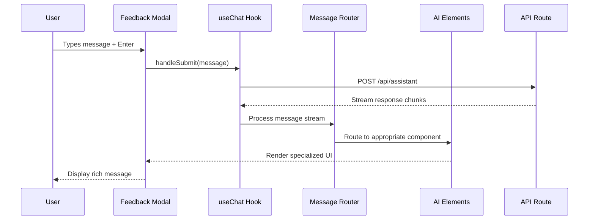
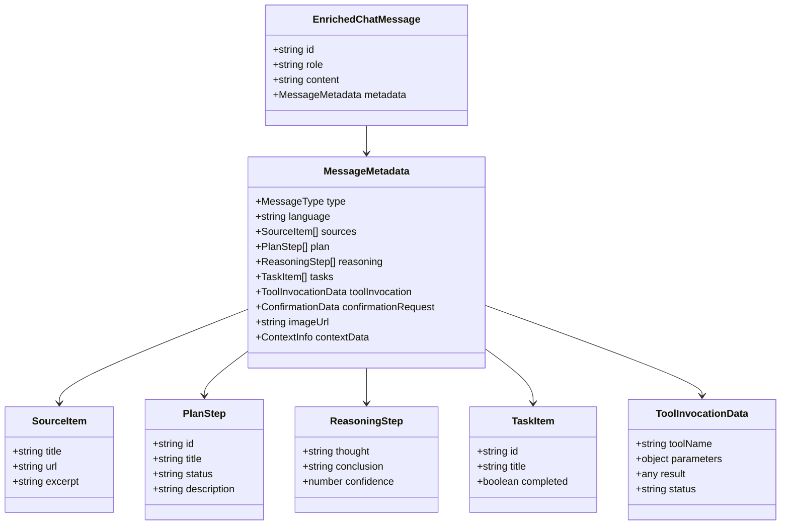
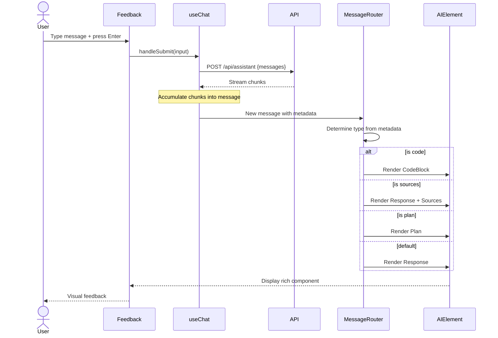
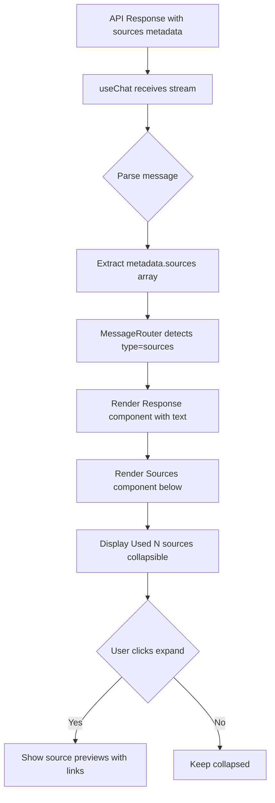
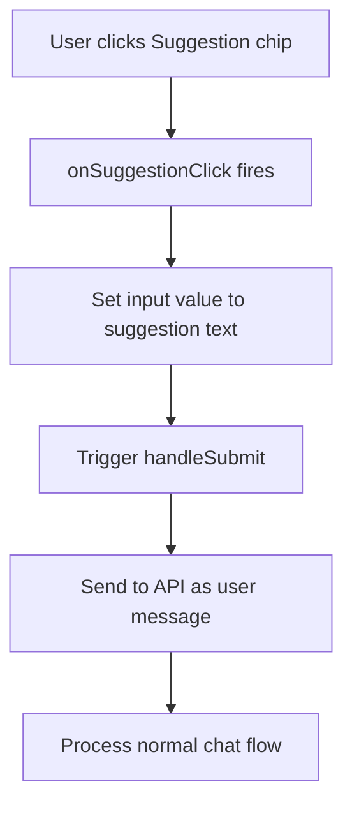
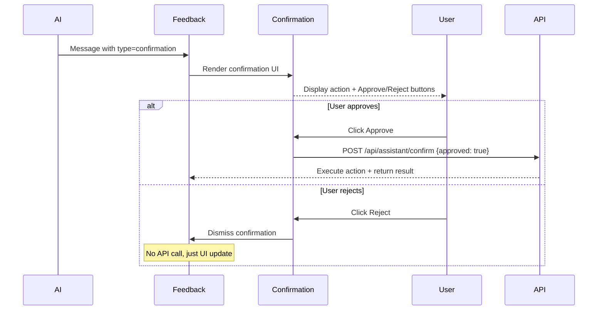

# Design Document: AI Elements Chat

## 1. Overview

Este documento descreve a arquitetura tecnica para substituir o chat AI atual por uma implementacao completa usando Vercel AI Elements, mantendo a UX de abertura existente (modal flutuante) mas com componentes ricos especializados.

**Design Goal**: Integrar componentes AI Elements do registro oficial do Vercel em src/components/ui/AiInput.tsx, criando uma experiencia de chat robusta com suporte a codigo, fontes, sugestoes, planos, raciocinio, tarefas e ferramentas.

**Scope**: Frontend apenas. Backend APIs permanecem inalterados.

## 2. Architecture Design

### 2.1 System Architecture Diagram

```mermaid
graph TB
    A[User] --> B[Feedback Modal Component]
    B --> C[useChat Hook - Vercel AI SDK]
    C --> D[Message Router]
    D --> E[AI Elements Components]
    
    E --> E1[Response]
    E --> E2[CodeBlock]
    E --> E3[Sources]
    E --> E4[Suggestion]
    E --> E5[Plan]
    E --> E6[Reasoning]
    E --> E7[Task]
    E --> E8[Tool]
    E --> E9[Confirmation]
    E --> E10[Image]
    E --> E11[Context]
    E --> E12[InlineCitation]
    E --> E13[Loader/Shimmer]
    
    C --> F[API Routes]
    F --> G[/api/assistant/route]
    G --> H[AI Models Provider]
```

### 2.2 Data Flow Diagram



### 2.3 Component Hierarchy

```
Feedback (existing modal container)
├── Header (SiriOrb + title + close button)
├── MessageList (scroll area)
│   ├── EmptyState (when messages.length === 0)
│   └── Message[] (map over messages)
│       ├── MessageContainer (user vs assistant styling)
│       └── MessageContent (dynamic component)
│           ├── Response (default text)
│           ├── CodeBlock (syntax highlighted code)
│           ├── Sources (collapsible sources panel)
│           ├── Plan (structured steps)
│           ├── Reasoning (thought process)
│           ├── Task (checklist items)
│           ├── Tool (tool invocation display)
│           ├── Confirmation (action approval UI)
│           ├── Image (rendered image)
│           ├── Context (context info)
│           └── InlineCitation (inline refs)
├── LoadingIndicator (Loader/Shimmer during streaming)
├── SuggestionChips (below messages, above input)
└── InputArea
    ├── ModelSelector
    ├── Textarea (input field)
    └── SubmitButton
```

## 3. Component Design

### 3.1 AI Elements Installation Strategy

**Decision**: Use shadcn CLI to install components from official registry

**Rationale**:
- Mantém atualizações oficiais
- Componentes ficam no código (customizáveis)
- Não adiciona dependência npm extra
- Integra perfeitamente com shadcn/ui existente

**Installation Command**:
```bash
npx shadcn@latest add https://registry.ai-sdk.dev/all.json
```

**Components to install**:
- `message` + `conversation` (estrutura base)
- `response` (resposta texto padrão)
- `code-block` (blocos de código)
- `sources` (fontes citadas)
- `suggestion` (chips de sugestão)
- `plan` (planos estruturados)
- `reasoning` (chain-of-thought)
- `task` (tarefas/checklists)
- `tool` (uso de ferramentas)
- `confirmation` (confirmações interativas)
- `image` (imagens geradas)
- `context` (informações de contexto)
- `inline-citation` (citações inline)
- `loader` + `shimmer` (loading states)

**Target Directory**: `src/components/ai-elements/` (seguindo padrão shadcn)

### 3.2 Message Type Schema

**Problem**: Como decidir qual componente renderizar para cada mensagem?

**Solution**: Metadata-based routing usando message.annotations ou message.experimental_attachments

**Type Definitions**:
```typescript
// Extend existing message type
interface EnrichedChatMessage extends Message {
  metadata?: {
    type?: 'text' | 'code' | 'sources' | 'plan' | 'reasoning' | 'task' | 'tool' | 'confirmation' | 'image' | 'context'
    language?: string // for code blocks
    sources?: SourceItem[]
    plan?: PlanStep[]
    reasoning?: ReasoningStep[]
    tasks?: TaskItem[]
    toolInvocation?: ToolInvocationData
    confirmationRequest?: ConfirmationData
    imageUrl?: string
    contextData?: ContextInfo
  }
}

interface SourceItem {
  title: string
  url: string
  excerpt?: string
}

interface PlanStep {
  id: string
  title: string
  status: 'pending' | 'in-progress' | 'completed'
  description?: string
}

interface ReasoningStep {
  thought: string
  conclusion?: string
}

interface TaskItem {
  id: string
  title: string
  completed: boolean
}

interface ToolInvocationData {
  toolName: string
  parameters: Record<string, any>
  result?: any
}

interface ConfirmationData {
  action: string
  description: string
  onConfirm: () => void
  onReject: () => void
}

interface ContextInfo {
  tokensUsed?: number
  model?: string
  responseTime?: number
}
```

### 3.3 Message Router Component

**Responsibility**: Decide qual AI Element renderizar baseado em message.metadata.type

**Implementation**:
```typescript
// src/components/ai-elements/MessageRouter.tsx
'use client'

import { Response } from './response'
import { CodeBlock } from './code-block'
import { Sources } from './sources'
import { Plan } from './plan'
import { Reasoning } from './reasoning'
import { Task } from './task'
import { Tool } from './tool'
import { Confirmation } from './confirmation'
import { Image as AIImage } from './image'
import { Context } from './context'
import type { EnrichedChatMessage } from '@/types/chat'

interface MessageRouterProps {
  message: EnrichedChatMessage
}

export function MessageRouter({ message }: MessageRouterProps) {
  const type = message.metadata?.type || 'text'
  
  switch (type) {
    case 'code':
      return (
        <CodeBlock 
          language={message.metadata?.language || 'plaintext'}
          code={message.content}
        />
      )
    
    case 'sources':
      return (
        <>
          <Response>{message.content}</Response>
          <Sources sources={message.metadata?.sources || []} />
        </>
      )
    
    case 'plan':
      return <Plan steps={message.metadata?.plan || []} />
    
    case 'reasoning':
      return <Reasoning steps={message.metadata?.reasoning || []} />
    
    case 'task':
      return <Task tasks={message.metadata?.tasks || []} />
    
    case 'tool':
      return (
        <Tool 
          toolName={message.metadata?.toolInvocation?.toolName || ''}
          parameters={message.metadata?.toolInvocation?.parameters || {}}
          result={message.metadata?.toolInvocation?.result}
        />
      )
    
    case 'confirmation':
      return (
        <Confirmation 
          action={message.metadata?.confirmationRequest?.action || ''}
          description={message.metadata?.confirmationRequest?.description || ''}
          onConfirm={message.metadata?.confirmationRequest?.onConfirm || (() => {})}
          onReject={message.metadata?.confirmationRequest?.onReject || (() => {})}
        />
      )
    
    case 'image':
      return <AIImage src={message.metadata?.imageUrl || ''} />
    
    case 'context':
      return (
        <>
          <Response>{message.content}</Response>
          <Context data={message.metadata?.contextData} />
        </>
      )
    
    default:
      return <Response>{message.content}</Response>
  }
}
```

### 3.4 Feedback Modal Refactor

**Current State** (src/components/ui/AiInput.tsx):
- Simple message bubbles (div with text)
- Basic loading dots
- No specialized components

**New Implementation**:
```typescript
// src/components/ui/AiInput.tsx (updated Feedback component)

import { Conversation, ConversationContent } from '@/components/ai-elements/conversation'
import { Message, MessageContent } from '@/components/ai-elements/message'
import { MessageRouter } from '@/components/ai-elements/MessageRouter'
import { Suggestion } from '@/components/ai-elements/suggestion'
import { Loader } from '@/components/ai-elements/loader'
import { Shimmer } from '@/components/ai-elements/shimmer'

function Feedback({ messages, input, handleInputChange, handleSubmit, isLoading, ... }) {
  const { closeFeedback, showFeedback } = useFooter()
  
  const suggestions = [
    'What are the latest trends in AI?',
    'How does machine learning work?',
    'Explain quantum computing',
    'Best practices for React hooks'
  ]
  
  function onSuggestionClick(text: string) {
    // Simulate user input
    handleInputChange({ target: { value: text } } as any)
    handleSubmit(new Event('submit') as any)
  }
  
  return (
    <form onSubmit={handleSubmit} className="flex flex-col h-full w-full">
      {showFeedback && (
        <motion.div className="flex h-full flex-col w-full">
          {/* Header unchanged */}
          <div className="flex justify-between items-center py-3 px-4 border-b border-neutral-800 bg-neutral-900/50">
            <div className="text-neutral-300 flex items-center gap-2 select-none text-sm font-medium">
              <SiriOrb size="20px" />
              Assistente AI
            </div>
            <button type="button" onClick={closeFeedback}>✕</button>
          </div>
          
          {/* Conversation area with AI Elements */}
          <div className="flex-1 overflow-y-auto p-4 sm:p-6">
            {messages.length === 0 ? (
              <EmptyState />
            ) : (
              <Conversation>
                <ConversationContent>
                  {messages.map((msg) => (
                    <Message 
                      key={msg.id} 
                      from={msg.role as 'user' | 'assistant'}
                    >
                      <MessageContent>
                        <MessageRouter message={msg} />
                      </MessageContent>
                    </Message>
                  ))}
                </ConversationContent>
              </Conversation>
            )}
            
            {isLoading && <Loader />}
          </div>
          
          {/* Suggestions */}
          {messages.length === 0 && (
            <div className="px-4 pb-3 flex flex-wrap gap-2">
              {suggestions.map((text) => (
                <Suggestion 
                  key={text}
                  text={text}
                  onClick={() => onSuggestionClick(text)}
                />
              ))}
            </div>
          )}
          
          {/* Input area unchanged */}
          <div className="border-t border-neutral-800 p-4">
            {/* ModelSelector + Textarea + SubmitButton */}
          </div>
        </motion.div>
      )}
    </form>
  )
}
```

### 3.5 Syntax Highlighting for CodeBlock

**Decision**: Use `shiki` (recommended by Vercel AI Elements docs)

**Rationale**:
- Zero runtime overhead (pre-compiled themes)
- Excellent TypeScript support
- 200+ languages
- Consistent with AI SDK ecosystem

**Installation**:
```bash
npm install shiki
```

**Usage in CodeBlock customization**:
```typescript
// src/components/ai-elements/code-block.tsx (after shadcn install, customize)
import { codeToHtml } from 'shiki'

async function highlightCode(code: string, language: string) {
  return await codeToHtml(code, {
    lang: language,
    theme: 'github-dark' // matches neutral dark theme
  })
}
```

## 4. Data Models

### 4.1 Chat Message Extended Type

```typescript
// src/types/chat.ts

import type { Message } from 'ai'

export interface SourceItem {
  title: string
  url: string
  excerpt?: string
  favicon?: string
}

export interface PlanStep {
  id: string
  title: string
  status: 'pending' | 'in-progress' | 'completed' | 'failed'
  description?: string
  substeps?: PlanStep[]
}

export interface ReasoningStep {
  thought: string
  conclusion?: string
  confidence?: number
}

export interface TaskItem {
  id: string
  title: string
  completed: boolean
  assignee?: string
  dueDate?: string
}

export interface ToolInvocationData {
  toolName: string
  parameters: Record<string, any>
  result?: any
  status: 'pending' | 'running' | 'completed' | 'error'
  error?: string
}

export interface ConfirmationData {
  action: string
  description: string
  confirmLabel?: string
  rejectLabel?: string
  onConfirm: () => void
  onReject: () => void
}

export interface ContextInfo {
  tokensUsed?: number
  model?: string
  responseTime?: number
  temperature?: number
  topP?: number
}

export type MessageType = 
  | 'text'
  | 'code'
  | 'sources'
  | 'plan'
  | 'reasoning'
  | 'task'
  | 'tool'
  | 'confirmation'
  | 'image'
  | 'context'

export interface MessageMetadata {
  type?: MessageType
  language?: string
  sources?: SourceItem[]
  plan?: PlanStep[]
  reasoning?: ReasoningStep[]
  tasks?: TaskItem[]
  toolInvocation?: ToolInvocationData
  confirmationRequest?: ConfirmationData
  imageUrl?: string
  contextData?: ContextInfo
  citations?: Array<{ index: number; sourceId: string }>
}

export interface EnrichedChatMessage extends Message {
  metadata?: MessageMetadata
}
```

### 4.2 Data Model Diagram



## 5. Business Process

### 5.1 Process: User Sends Message



### 5.2 Process: AI Returns Sources



### 5.3 Process: User Clicks Suggestion



### 5.4 Process: Confirmation Workflow



## 6. Integration Points

### 6.1 Existing Components Integration

**ModelSelector** (src/components/ai/ModelSelector.tsx):
- Import unchanged in Feedback
- Position in input area maintained
- Props interface remains compatible

**SiriOrb** (src/components/ui/SiriOrb.tsx):
- Used in header (unchanged)
- Used in EmptyState (unchanged)
- No modifications needed

**useChat Hook** (from 'ai' package):
- Already implemented in Feedback
- Add metadata parsing logic
- Extend type definitions

### 6.2 API Route Expectations

**Current**: /api/assistant/route.ts returns text stream

**Enhancement needed**: API should return metadata alongside text

**Example API response format** (using experimental_streamData):
```typescript
// src/app/api/assistant/route.ts
import { streamText, experimental_streamData } from 'ai'

export async function POST(req: Request) {
  const { messages } = await req.json()
  
  const result = await streamText({
    model: anthropic('claude-3-5-sonnet-20241022'),
    messages,
    // ...
  })
  
  // Inject metadata via experimental features
  return result.toDataStreamResponse({
    // Custom metadata per message chunk
    data: {
      metadata: {
        type: 'sources',
        sources: [
          { title: 'React Docs', url: 'https://react.dev', excerpt: '...' }
        ]
      }
    }
  })
}
```

**Note**: If API changes are out of scope (per requirements), MessageRouter will default to 'text' type and render Response component for all messages. Metadata support can be added later without breaking changes.

## 7. Error Handling Strategy

### 7.1 Component-Level Error Boundaries

```typescript
// src/components/ai-elements/ErrorBoundary.tsx
'use client'

import React from 'react'

export class AIElementErrorBoundary extends React.Component {
  state = { hasError: false, error: null }
  
  static getDerivedStateFromError(error: Error) {
    return { hasError: true, error }
  }
  
  componentDidCatch(error: Error, info: React.ErrorInfo) {
    console.error('AI Element Error:', error, info)
  }
  
  render() {
    if (this.state.hasError) {
      return (
        <div className="p-3 bg-red-900/20 border border-red-700/60 rounded-lg text-sm text-red-400">
          Failed to render AI component. Please try again.
        </div>
      )
    }
    
    return this.props.children
  }
}
```

**Usage**: Wrap MessageRouter in ErrorBoundary

```typescript
<Message from={msg.role}>
  <MessageContent>
    <AIElementErrorBoundary>
      <MessageRouter message={msg} />
    </AIElementErrorBoundary>
  </MessageContent>
</Message>
```

### 7.2 Missing Data Fallbacks

Every AI Element component should handle missing data gracefully:

```typescript
// Example: Sources component
export function Sources({ sources = [] }: { sources?: SourceItem[] }) {
  if (sources.length === 0) return null // graceful degradation
  
  return <div>Used {sources.length} sources</div>
}
```

### 7.3 Loading State Management

```typescript
// Feedback component loading logic
{isLoading && (
  <div className="flex justify-start">
    <Shimmer /> {/* AI Element component */}
  </div>
)}

{error && (
  <div className="p-3 bg-red-900/20 text-red-400 rounded-lg text-sm">
    {error.message}
    <button onClick={reload} className="ml-2 underline">Retry</button>
  </div>
)}
```

## 8. Testing Strategy

### 8.1 Unit Tests

**Component Tests** (using React Testing Library):

```typescript
// src/components/ai-elements/__tests__/MessageRouter.test.tsx
import { render, screen } from '@testing-library/react'
import { MessageRouter } from '../MessageRouter'

describe('MessageRouter', () => {
  it('renders Response for text type', () => {
    const msg = { id: '1', role: 'assistant', content: 'Hello', metadata: { type: 'text' } }
    render(<MessageRouter message={msg} />)
    expect(screen.getByText('Hello')).toBeInTheDocument()
  })
  
  it('renders CodeBlock for code type', () => {
    const msg = { 
      id: '1', 
      role: 'assistant', 
      content: 'const x = 1', 
      metadata: { type: 'code', language: 'javascript' } 
    }
    render(<MessageRouter message={msg} />)
    expect(screen.getByText('const x = 1')).toBeInTheDocument()
  })
  
  // ... more tests for each type
})
```

**Test Coverage Goals**:
- MessageRouter: 100% branch coverage
- Individual AI Elements: 80%+ coverage
- Error boundaries: edge cases tested

### 8.2 Integration Tests

**Test: Full chat flow**
```typescript
// src/__tests__/integration/chat-flow.test.tsx
import { render, screen, fireEvent, waitFor } from '@testing-library/react'
import { Feedback } from '@/components/ui/AiInput'

describe('Chat Integration', () => {
  it('sends message and renders AI response', async () => {
    const mockHandleSubmit = jest.fn()
    render(<Feedback messages={[]} handleSubmit={mockHandleSubmit} ... />)
    
    const input = screen.getByPlaceholderText(/adicione/i)
    fireEvent.change(input, { target: { value: 'Hello AI' } })
    fireEvent.submit(input.closest('form'))
    
    expect(mockHandleSubmit).toHaveBeenCalled()
    
    // Mock response
    await waitFor(() => {
      expect(screen.getByText(/thinking/i)).toBeInTheDocument()
    })
  })
})
```

### 8.3 Visual Regression Tests

**Tool**: Playwright + Percy/Chromatic

**Test Scenarios**:
- Empty chat state
- Chat with multiple message types (text, code, sources)
- Loading states (shimmer, loader)
- Error states
- Suggestion chips visible
- Mobile vs desktop layouts

## 9. Deployment Considerations

### 9.1 Dependencies to Add

```json
{
  "dependencies": {
    "shiki": "^1.0.0"
  }
}
```

**Note**: AI Elements components are NOT npm dependencies. They are installed via shadcn CLI and become part of the codebase.

### 9.2 Build Validation

Before deploying:

```bash
# TypeScript check
npm run typecheck

# Lint check
npm run lint

# Build check
npm run build
```

**Expected outcome**: Zero TypeScript errors, zero ESLint errors, successful Next.js build.

### 9.3 Environment Variables

No new env vars needed (AI_GATEWAY_API_KEY already exists if using gateway).

### 9.4 Migration Path

**Phase 1**: Install AI Elements components
```bash
npx shadcn@latest add https://registry.ai-sdk.dev/all.json
```

**Phase 2**: Create MessageRouter and types (no visual changes yet)

**Phase 3**: Replace Feedback message rendering with AI Elements (visual changes visible)

**Phase 4**: Add suggestions, enhance with metadata support

**Rollback Strategy**: Git revert to previous Feedback implementation. AI Elements components can remain in codebase unused.

## 10. Performance Considerations

### 10.1 Code Splitting

Lazy load heavy AI Elements:

```typescript
import dynamic from 'next/dynamic'

const CodeBlock = dynamic(() => import('@/components/ai-elements/code-block'), {
  loading: () => <Shimmer />,
  ssr: false
})
```

### 10.2 Virtualization

If chat history grows large (100+ messages), implement virtual scrolling:

```typescript
import { useVirtualizer } from '@tanstack/react-virtual'

// In Feedback component
const virtualizer = useVirtualizer({
  count: messages.length,
  getScrollElement: () => scrollRef.current,
  estimateSize: () => 100,
})
```

### 10.3 Memoization

Prevent unnecessary re-renders:

```typescript
const MemoizedMessageRouter = React.memo(MessageRouter, (prev, next) => {
  return prev.message.id === next.message.id && 
         prev.message.content === next.message.content
})
```

## 11. Accessibility (A11y)

### 11.1 Keyboard Navigation

- Tab order: Header close button → Messages → Suggestions → Input → Submit
- Enter in input: Submit message
- Shift+Enter: New line
- Escape: Close modal
- Arrow keys: Navigate suggestions

### 11.2 ARIA Labels

```typescript
<button 
  onClick={closeFeedback}
  aria-label="Close AI assistant"
>
  ✕
</button>

<Suggestion 
  text="What are AI trends?"
  onClick={...}
  role="button"
  tabIndex={0}
  aria-label="Quick question: What are AI trends?"
/>
```

### 11.3 Screen Reader Support

- Message roles announced ("User says...", "Assistant says...")
- Loading states announced ("AI is thinking")
- Code blocks announced with language ("JavaScript code block")

## 12. Design Tokens & Theming

### 12.1 Color Palette (Neutral Dark Theme)

```css
/* Already in globals.css, ensure consistency */
--background: 0 0% 10%; /* neutral-950 */
--foreground: 0 0% 90%; /* neutral-100 */
--card: 0 0% 12%; /* neutral-900 */
--card-foreground: 0 0% 80%; /* neutral-300 */
--border: 0 0% 25%; /* neutral-800 */
--input: 0 0% 20%; /* neutral-900/70 */
--primary: 0 0% 85%; /* neutral-200 */
--ring: 0 0% 30%; /* neutral-700 */
```

### 12.2 Typography

```css
/* Message text */
.message-content {
  @apply text-sm text-neutral-300;
}

/* Code blocks */
.code-block {
  @apply text-xs font-mono bg-neutral-900 border border-neutral-800;
}

/* Suggestions */
.suggestion-chip {
  @apply text-sm text-neutral-400 hover:text-neutral-200;
}
```

### 12.3 Spacing & Layout

```css
/* Message spacing */
.message-list {
  @apply space-y-3; /* 12px between messages */
}

/* Modal padding */
.feedback-modal {
  @apply p-4 sm:p-6; /* responsive padding */
}
```

## 13. Technical Risks & Mitigation

| Risk | Impact | Probability | Mitigation |
|------|--------|-------------|------------|
| AI Elements registry unavailable during install | High | Low | Cache components locally, commit to git |
| Shiki bundle size too large | Medium | Medium | Lazy load, use lightweight themes, consider dynamic imports |
| Metadata schema mismatch between API and frontend | High | Medium | Default to 'text' type if metadata missing, add validation layer |
| Performance degradation with many messages | Medium | Medium | Implement virtualization, memoization, lazy loading |
| Breaking changes in AI SDK v6 | High | Low | Pin AI SDK version, monitor changelog |

## 14. Future Enhancements (Out of Scope for v1)

- Chat history persistence (localStorage or database)
- Export chat as PDF/Markdown
- Voice input integration (SiriOrb becomes functional)
- Multi-modal inputs (file uploads, images)
- Real-time collaboration (multiple users in same chat)
- Custom themes (light mode, user-defined colors)
- Advanced reasoning visualizations (tree view for chain-of-thought)
- Tool execution sandbox (run code snippets safely)

## 15. Acceptance Validation Checklist

Before marking design as approved:

- [ ] All 14 AI Elements components mapped to use cases
- [ ] MessageRouter logic clearly defined
- [ ] Type definitions complete and consistent
- [ ] Error handling strategy covers all edge cases
- [ ] Testing strategy includes unit, integration, and visual tests
- [ ] Performance optimizations identified
- [ ] Accessibility requirements addressed
- [ ] Migration path defined
- [ ] Rollback strategy documented
- [ ] No breaking changes to existing API routes (or documented if needed)
