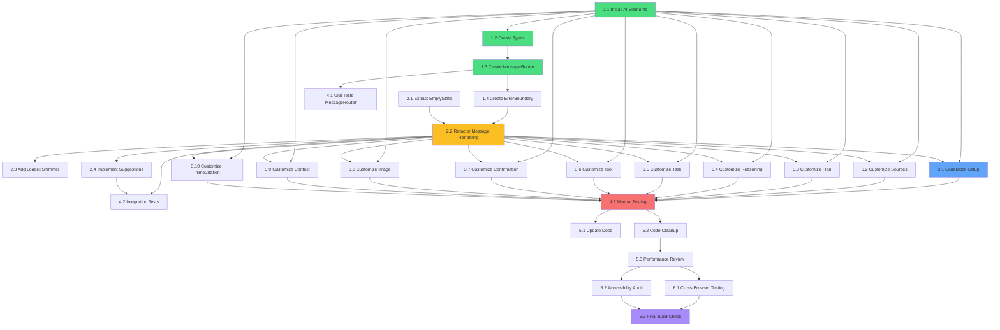

# Implementation Plan: AI Elements Chat

## Task Overview

Este plano detalha as tarefas de implementacao necessarias para integrar Vercel AI Elements no chat AI existente. Cada tarefa e atomica, testavel e contem criterios de aceitacao claros.

**Total Estimated Time**: 8-12 hours
**Complexity**: Medium-High
**Dependencies**: Todas as tarefas dependem do projeto Next.js existente estar funcional

---

## Phase 1: Foundation & Setup

### Task 1.1: Install Vercel AI Elements Components

**Objective**: Instalar todos os componentes AI Elements via shadcn CLI no projeto

**Agent**: Claude
**Priority**: High
**Dependencies**: None
**Estimated Time**: 15 minutes

**Files**:
- `src/components/ai-elements/` (novo diretorio criado automaticamente)
- `package.json` (shiki adicionado)
- `components.json` (verificar/atualizar config shadcn)

**Steps**:
1. Verificar se shadcn/ui esta configurado (npx shadcn@latest init se necessario)
2. Executar: `npx shadcn@latest add https://registry.ai-sdk.dev/all.json`
3. Confirmar instalacao de todos os componentes listados
4. Instalar shiki para syntax highlighting: `npm install shiki`
5. Verificar que componentes foram criados em `src/components/ai-elements/`

**Acceptance Criteria**:
- Diretorio `src/components/ai-elements/` existe com pelo menos 14 componentes
- `package.json` contem `shiki` nas dependencies
- Build do projeto roda sem erros: `npm run build`
- Nenhum erro TypeScript ao importar componentes AI Elements

**Requirements**: FR-1, NFR-3

---

### Task 1.2: Create TypeScript Type Definitions

**Objective**: Criar tipos TypeScript para mensagens enriquecidas e metadata

**Agent**: Codex
**Priority**: High
**Dependencies**: Task 1.1
**Estimated Time**: 20 minutes

**Files**:
- `src/types/chat.ts` (novo arquivo)

**Steps**:
1. Criar arquivo `src/types/chat.ts`
2. Definir interface `SourceItem` com title, url, excerpt, favicon
3. Definir interface `PlanStep` com id, title, status, description, substeps
4. Definir interface `ReasoningStep` com thought, conclusion, confidence
5. Definir interface `TaskItem` com id, title, completed, assignee, dueDate
6. Definir interface `ToolInvocationData` com toolName, parameters, result, status, error
7. Definir interface `ConfirmationData` com action, description, labels, callbacks
8. Definir interface `ContextInfo` com tokensUsed, model, responseTime, etc
9. Definir type union `MessageType` com todos os tipos possiveis
10. Definir interface `MessageMetadata` agregando todas as interfaces acima
11. Definir interface `EnrichedChatMessage` extends Message (do package ai) com metadata opcional
12. Exportar todos os tipos

**Acceptance Criteria**:
- Arquivo `src/types/chat.ts` existe e compila sem erros TypeScript
- Todos os 11 tipos/interfaces estao definidos e exportados
- `EnrichedChatMessage extends Message` do package ai
- Executar `npm run typecheck` sem erros relacionados a chat types
- Copiar arquivo final para `ai_specs/ai-elements-chat/tests/chat.ts`

**Requirements**: FR-2, NFR-3

---

### Task 1.3: Create MessageRouter Component

**Objective**: Implementar componente que roteia mensagens para AI Elements corretos

**Agent**: Claude
**Priority**: High
**Dependencies**: Task 1.1, Task 1.2
**Estimated Time**: 30 minutes

**Files**:
- `src/components/ai-elements/MessageRouter.tsx` (novo arquivo)

**Steps**:
1. Criar arquivo `src/components/ai-elements/MessageRouter.tsx`
2. Importar todos os AI Elements components (Response, CodeBlock, Sources, etc)
3. Importar tipos do `src/types/chat.ts`
4. Definir interface `MessageRouterProps` com message: EnrichedChatMessage
5. Implementar funcao `MessageRouter` que recebe props
6. Extrair `message.metadata?.type` com fallback para text
7. Implementar switch statement para cada MessageType
8. Case code: renderizar CodeBlock com language e content
9. Case sources: renderizar Response + Sources component
10. Case plan: renderizar Plan component com steps
11. Case reasoning: renderizar Reasoning component
12. Case task: renderizar Task component
13. Case tool: renderizar Tool component
14. Case confirmation: renderizar Confirmation component
15. Case image: renderizar Image component
16. Case context: renderizar Response + Context component
17. Default case: renderizar Response com content
18. Adicionar use client directive no topo
19. Exportar MessageRouter

**Acceptance Criteria**:
- Arquivo `src/components/ai-elements/MessageRouter.tsx` existe
- Switch statement cobre todos os 9+ MessageTypes
- Cada case renderiza o componente AI Element apropriado
- Default case renderiza Response (graceful degradation)
- Nenhum erro TypeScript ao importar MessageRouter
- Executar `npm run build` sem erros
- Copiar arquivo final para `ai_specs/ai-elements-chat/tests/MessageRouter.tsx`

**Requirements**: FR-2, NFR-3

---

### Task 1.4: Create Error Boundary for AI Elements

**Objective**: Implementar error boundary para capturar erros de renderizacao dos AI Elements

**Agent**: Codex
**Priority**: Medium
**Dependencies**: Task 1.3
**Estimated Time**: 15 minutes

**Files**:
- `src/components/ai-elements/AIElementErrorBoundary.tsx` (novo arquivo)

**Steps**:
1. Criar arquivo `src/components/ai-elements/AIElementErrorBoundary.tsx`
2. Importar React e componentes necessarios
3. Criar class component AIElementErrorBoundary extends React.Component
4. Definir state com hasError: boolean e error: Error | null
5. Implementar static getDerivedStateFromError
6. Implementar componentDidCatch com console.error
7. Implementar render que mostra fallback UI se hasError true
8. Fallback UI: div com bg-red-900/20, border-red-700/60, text-red-400
9. Texto do fallback: Failed to render AI component. Please try again.
10. Se nao tiver erro, renderizar this.props.children
11. Adicionar use client directive no topo
12. Exportar AIElementErrorBoundary

**Acceptance Criteria**:
- Arquivo `src/components/ai-elements/AIElementErrorBoundary.tsx` existe
- Error boundary captura erros de componentes filhos
- Fallback UI consistente com tema neutral dark
- Executar `npm run build` sem erros
- Copiar arquivo final para `ai_specs/ai-elements-chat/tests/AIElementErrorBoundary.tsx`

**Requirements**: NFR-4

---

## Phase 2: Feedback Modal Refactor

### Task 2.1: Extract EmptyState Component

**Objective**: Extrair o estado vazio do chat para componente reutilizavel

**Agent**: Droid
**Priority**: Medium
**Dependencies**: None
**Estimated Time**: 10 minutes

**Files**:
- `src/components/ui/AiInput.tsx` (modificar)
- `src/components/ai-elements/EmptyState.tsx` (novo arquivo)

**Steps**:
1. Criar arquivo `src/components/ai-elements/EmptyState.tsx`
2. Copiar JSX do estado vazio atual (div com SiriOrb, titulo, paragrafo)
3. Manter estilos: flex flex-col items-center justify-center h-full min-h-200px
4. SiriOrb size 48px com bg oklch(22.64% 0 0)
5. Titulo: text-neutral-300 text-lg font-medium mb-2
6. Paragrafo: text-neutral-500 text-sm max-w-xs
7. Exportar EmptyState como funcao component
8. Adicionar use client directive
9. Em `src/components/ui/AiInput.tsx`, importar EmptyState
10. Substituir JSX inline por <EmptyState />

**Acceptance Criteria**:
- Arquivo `src/components/ai-elements/EmptyState.tsx` existe
- Componente renderiza SiriOrb + texto quando messages.length === 0
- Estilos identicos ao estado anterior
- `src/components/ui/AiInput.tsx` usa <EmptyState /> ao inves de JSX inline
- Visual identico ao estado anterior
- Executar `npm run dev` e verificar que chat vazio funciona
- Copiar arquivo final para `ai_specs/ai-elements-chat/tests/EmptyState.tsx`

**Requirements**: FR-3, NFR-3

---

### Task 2.2: Refactor Message Rendering to Use AI Elements

**Objective**: Substituir renderizacao simples de mensagens por AI Elements (Conversation, Message, MessageContent, MessageRouter)

**Agent**: Claude
**Priority**: High
**Dependencies**: Task 1.3, Task 1.4, Task 2.1
**Estimated Time**: 45 minutes

**Files**:
- `src/components/ui/AiInput.tsx` (modificar funcao Feedback)

**Steps**:
1. Abrir `src/components/ui/AiInput.tsx`
2. Importar Conversation, ConversationContent do `@/components/ai-elements/conversation`
3. Importar Message, MessageContent do `@/components/ai-elements/message`
4. Importar MessageRouter do `@/components/ai-elements/MessageRouter`
5. Importar AIElementErrorBoundary do `@/components/ai-elements/AIElementErrorBoundary`
6. Localizar area de renderizacao de mensagens (messages.map)
7. Substituir estrutura de divs simples por:
   ```tsx
   <Conversation>
     <ConversationContent>
       {messages.map((msg) => (
         <Message key={msg.id} from={msg.role as 'user' | 'assistant'}>
           <MessageContent>
             <AIElementErrorBoundary>
               <MessageRouter message={msg} />
             </AIElementErrorBoundary>
           </MessageContent>
         </Message>
       ))}
     </ConversationContent>
   </Conversation>
   ```
8. Remover codigo antigo de renderizacao (divs com flex justify-end/start)
9. Remover funcao `renderMessage` se existir
10. Manter logica de EmptyState (if messages.length === 0)
11. Verificar que msg.role e compativel com from prop (user | assistant)

**Acceptance Criteria**:
- Mensagens renderizadas usando Conversation + Message components
- MessageRouter integrado com ErrorBoundary
- Remocao completa da renderizacao antiga (divs simples)
- Chat funcional com mensagens text basicas
- Executar `npm run dev` e testar enviar mensagem
- Mensagens aparecem com estilo AI Elements (nao mais divs simples)
- Executar `npm run build` sem erros
- Copiar secao modificada para `ai_specs/ai-elements-chat/tests/AiInput-messages.tsx`

**Requirements**: FR-2, FR-3, AC-1

---

### Task 2.3: Add Loader and Shimmer Components for Loading States

**Objective**: Substituir loading dots basicos por componentes Loader e Shimmer

**Agent**: Droid
**Priority**: Medium
**Dependencies**: Task 2.2
**Estimated Time**: 15 minutes

**Files**:
- `src/components/ui/AiInput.tsx` (modificar)

**Steps**:
1. Abrir `src/components/ui/AiInput.tsx`
2. Importar Loader do `@/components/ai-elements/loader`
3. Importar Shimmer do `@/components/ai-elements/shimmer`
4. Localizar codigo de loading (if isLoading)
5. Remover div com flex space-x-1 (loading dots atuais)
6. Substituir por:
   ```tsx
   {isLoading && (
     <div className="flex justify-start">
       <Loader />
     </div>
   )}
   ```
7. Opcional: adicionar Shimmer para mensagens parciais durante streaming
8. Testar visualmente que loading state aparece ao enviar mensagem

**Acceptance Criteria**:
- Loading dots antigos removidos
- Loader component renderiza quando isLoading true
- Estilo consistente com tema neutral dark
- Executar `npm run dev` e verificar loading visual ao enviar mensagem
- Copiar secao modificada para `ai_specs/ai-elements-chat/tests/AiInput-loading.tsx`

**Requirements**: FR-2, AC-5

---

### Task 2.4: Implement Suggestion Chips

**Objective**: Adicionar chips de sugestoes clicaveis abaixo da area de mensagens

**Agent**: Claude
**Priority**: Medium
**Dependencies**: Task 2.2
**Estimated Time**: 25 minutes

**Files**:
- `src/components/ui/AiInput.tsx` (modificar)

**Steps**:
1. Abrir `src/components/ui/AiInput.tsx`
2. Importar Suggestion do `@/components/ai-elements/suggestion`
3. Definir array de sugestoes dentro de Feedback component:
   ```typescript
   const suggestions = [
     'What are the latest trends in AI?',
     'How does machine learning work?',
     'Explain quantum computing',
     'Best practices for React hooks'
   ]
   ```
4. Criar funcao `onSuggestionClick(text: string)`:
   ```typescript
   function onSuggestionClick(text: string) {
     handleInputChange({ target: { value: text } } as any)
     handleSubmit(new Event('submit') as any)
   }
   ```
5. Adicionar secao de Suggestions abaixo de messages area e acima de input:
   ```tsx
   {messages.length === 0 && (
     <div className="px-4 pb-3 flex flex-wrap gap-2">
       {suggestions.map((text) => (
         <Suggestion 
           key={text}
           text={text}
           onClick={() => onSuggestionClick(text)}
         />
       ))}
     </div>
   )}
   ```
6. Ajustar estilos se necessario para match com screenshot (chips horizontais)
7. Testar click em suggestion e verificar que envia mensagem

**Acceptance Criteria**:
- Suggestion chips renderizados quando chat esta vazio
- Chips desaparecem apos primeira mensagem (messages.length === 0 check)
- Click em chip popula input e envia mensagem automaticamente
- Estilo visual match com screenshot fornecido
- Executar `npm run dev` e testar click em cada suggestion
- Copiar secao modificada para `ai_specs/ai-elements-chat/tests/AiInput-suggestions.tsx`

**Requirements**: FR-2, US-3, AC-4

---

## Phase 3: Specialized AI Elements Integration (15 components)

### Task 3.1: Implement CodeBlock with Syntax Highlighting

**Objective**: Configurar CodeBlock component para usar shiki e renderizar codigo com syntax highlighting

**Agent**: Claude
**Priority**: High
**Dependencies**: Task 1.1, Task 2.2
**Estimated Time**: 30 minutes

**Files**:
- `src/components/ai-elements/code-block.tsx` (modificar component instalado)
- `src/lib/highlight.ts` (novo arquivo helper)

**Steps**:
1. Criar arquivo `src/lib/highlight.ts`
2. Importar `codeToHtml` do shiki
3. Criar funcao async `highlightCode(code: string, language: string)`:
   ```typescript
   import { codeToHtml } from 'shiki'
   
   export async function highlightCode(code: string, language: string) {
     return await codeToHtml(code, {
       lang: language || 'plaintext',
       theme: 'github-dark'
     })
   }
   ```
4. Abrir `src/components/ai-elements/code-block.tsx`
5. Integrar highlightCode no component
6. Ajustar estilos para match com neutral dark theme
7. Adicionar copy button functionality (se nao existir)
8. Testar renderizacao com codigo JavaScript, Python, TypeScript

**Acceptance Criteria**:
- CodeBlock renderiza codigo com syntax highlighting correto
- Tema github-dark consistente com neutral colors
- Copy button funcional (copia codigo para clipboard)
- Suporta pelo menos 10 linguagens (js, ts, py, rust, go, etc)
- Executar `npm run dev` e testar renderizar codigo via MessageRouter
- Criar mensagem de teste com metadata type code para validar
- Copiar arquivo final para `ai_specs/ai-elements-chat/tests/code-block.tsx`

**Requirements**: FR-2, US-1, AC-2

---

### Task 3.2: Customize Sources Component

**Objective**: Adaptar Sources component para mostrar Used N sources com preview expansivel

**Agent**: Droid
**Priority**: Medium
**Dependencies**: Task 1.1, Task 2.2
**Estimated Time**: 20 minutes

**Files**:
- `src/components/ai-elements/sources.tsx` (modificar component instalado)

**Steps**:
1. Abrir `src/components/ai-elements/sources.tsx`
2. Verificar interface SourceItem aceita title, url, excerpt
3. Ajustar renderizacao para mostrar Used N sources (collapsed state)
4. Implementar expansao ao click (mostrar lista de sources)
5. Cada source item mostra title (link), url, excerpt
6. Adicionar estilos consistentes com neutral dark theme
7. Adicionar animacao de expand/collapse (framer-motion)
8. Testar com 1, 2, 5 sources

**Acceptance Criteria**:
- Sources component mostra Used N sources quando collapsed
- Click expande e mostra lista detalhada de sources
- Cada source e clicavel (abre url em nova tab)
- Estilo visual match com screenshot fornecido
- Executar `npm run dev` e testar com mock sources data
- Copiar arquivo final para `ai_specs/ai-elements-chat/tests/sources.tsx`

**Requirements**: FR-2, US-2, AC-3

---

### Task 3.3: Customize Plan Component

**Objective**: Adaptar Plan component para mostrar passos estruturados com status

**Agent**: Codex
**Priority**: Medium
**Dependencies**: Task 1.1, Task 2.2
**Estimated Time**: 20 minutes

**Files**:
- `src/components/ai-elements/plan.tsx` (modificar component instalado)

**Steps**:
1. Abrir `src/components/ai-elements/plan.tsx`
2. Verificar interface PlanStep com id, title, status, description
3. Renderizar lista de steps com indicadores visuais de status
4. Status pending: cinza neutral-600
5. Status in-progress: azul ou amarelo
6. Status completed: verde
7. Status failed: vermelho
8. Adicionar icones de status (CheckIcon, SpinnerIcon, etc)
9. Suportar substeps (nested plan items)
10. Ajustar estilos para match com tema

**Acceptance Criteria**:
- Plan component renderiza lista de steps com status visual
- Cores de status claras e distintas
- Substeps renderizados com indentacao
- Executar `npm run dev` e testar com mock plan data
- Copiar arquivo final para `ai_specs/ai-elements-chat/tests/plan.tsx`

**Requirements**: FR-2, US-5, AC-6

---

### Task 3.4: Customize Reasoning Component

**Objective**: Adaptar Reasoning component para mostrar processo de pensamento expansivel

**Agent**: Claude
**Priority**: Medium
**Dependencies**: Task 1.1, Task 2.2
**Estimated Time**: 20 minutes

**Files**:
- `src/components/ai-elements/reasoning.tsx` (modificar component instalado)

**Steps**:
1. Abrir `src/components/ai-elements/reasoning.tsx`
2. Verificar interface ReasoningStep com thought, conclusion, confidence
3. Implementar estado expansivel (collapsed por padrao)
4. Mostrar Thinking... ou AI Reasoning quando collapsed
5. Click expande e mostra lista de thoughts
6. Cada thought renderizado como paragrafo
7. Conclusion renderizada em destaque se existir
8. Confidence mostrada como badge ou porcentagem
9. Ajustar estilos neutral dark

**Acceptance Criteria**:
- Reasoning component collapsed por padrao com indicador Thinking
- Click expande e mostra lista de reasoning steps
- Conclusion destacada visualmente
- Confidence badge funcional se presente
- Executar `npm run dev` e testar com mock reasoning data
- Copiar arquivo final para `ai_specs/ai-elements-chat/tests/reasoning.tsx`

**Requirements**: FR-2, US-4, AC-12

---

### Task 3.5: Customize Task Component

**Objective**: Adaptar Task component para mostrar tarefas em formato checklist

**Agent**: Droid
**Priority**: Medium
**Dependencies**: Task 1.1, Task 2.2
**Estimated Time**: 20 minutes

**Files**:
- `src/components/ai-elements/task.tsx` (modificar component instalado)

**Steps**:
1. Abrir `src/components/ai-elements/task.tsx`
2. Verificar interface TaskItem com id, title, completed
3. Renderizar lista de tasks como checkboxes
4. Checkbox checked se completed true
5. Toggle completed ao click (callback opcional)
6. Estilos consistentes com SubtaskItem em DetailPanel.tsx
7. Adicionar assignee e dueDate se presentes
8. Line-through em tasks completed

**Acceptance Criteria**:
- Task component renderiza checklist de tarefas
- Checkboxes funcionais (visual feedback ao toggle)
- Tasks completed com line-through
- Estilo visual consistente com DetailPanel existing tasks
- Executar `npm run dev` e testar com mock task data
- Copiar arquivo final para `ai_specs/ai-elements-chat/tests/task.tsx`

**Requirements**: FR-2, US-7, AC-7

---

### Task 3.6: Customize Tool Component

**Objective**: Adaptar Tool component para mostrar uso de ferramentas pela IA

**Agent**: Codex
**Priority**: Medium
**Dependencies**: Task 1.1, Task 2.2
**Estimated Time**: 20 minutes

**Files**:
- `src/components/ai-elements/tool.tsx` (modificar component instalado)

**Steps**:
1. Abrir `src/components/ai-elements/tool.tsx`
2. Verificar interface ToolInvocationData com toolName, parameters, result, status
3. Renderizar nome da ferramenta em destaque
4. Mostrar parametros em formato JSON colapsavel
5. Mostrar resultado se presente
6. Indicador de status (pending, running, completed, error)
7. Se error, mostrar mensagem de erro em vermelho
8. Estilos neutral dark com badges de status coloridos

**Acceptance Criteria**:
- Tool component mostra toolName e status
- Parametros renderizados como JSON formatado
- Resultado mostrado se presente
- Status visual claro (spinner para running, check para completed, X para error)
- Executar `npm run dev` e testar com mock tool data
- Copiar arquivo final para `ai_specs/ai-elements-chat/tests/tool.tsx`

**Requirements**: FR-2, US-8, AC-8

---

### Task 3.6.1: Customize Queue Component

**Objective**: Adaptar Queue component para gerenciar fila de mensagens e processamento

**Agent**: Droid
**Priority**: Medium
**Dependencies**: Task 1.1, Task 2.2
**Estimated Time**: 20 minutes

**Files**:
- `src/components/ai-elements/queue.tsx` (modificar component instalado)

**Steps**:
1. Abrir `src/components/ai-elements/queue.tsx`
2. Definir interface QueueItem com id, type, content, status, priority
3. Renderizar lista de items em fila de processamento
4. Mostrar status de cada item (pending, processing, completed, failed)
5. Indicador visual de progresso (numero de items processados / total)
6. Permitir reordenar items por prioridade
7. Mostrar attachments se presentes (arquivos, imagens)
8. Estilos neutral dark com badges de status coloridos
9. Adicionar botao para limpar items completed
10. Animacao de transicao quando items mudam de status

**Acceptance Criteria**:
- Queue component renderiza lista de items com status
- Status visual claro para cada item (cores diferentes)
- Progress indicator funcional
- Attachments renderizados se presentes
- Botao de limpar items completed funciona
- Animacoes suaves na mudanca de status
- Executar `npm run dev` e testar com mock queue data
- Copiar arquivo final para `ai_specs/ai-elements-chat/tests/queue.tsx`

**Requirements**: FR-2

---

### Task 3.7: Customize Confirmation Component

**Objective**: Adaptar Confirmation component para solicitar aprovacao de usuario

**Agent**: Claude
**Priority**: Medium
**Dependencies**: Task 1.1, Task 2.2
**Estimated Time**: 25 minutes

**Files**:
- `src/components/ai-elements/confirmation.tsx` (modificar component instalado)

**Steps**:
1. Abrir `src/components/ai-elements/confirmation.tsx`
2. Verificar interface ConfirmationData com action, description, onConfirm, onReject
3. Renderizar action em titulo destacado
4. Mostrar description como paragrafo
5. Dois botoes: Approve (verde) e Reject (vermelho/neutro)
6. Click em Approve chama onConfirm callback
7. Click em Reject chama onReject callback
8. Labels customizaveis (confirmLabel, rejectLabel)
9. Estilos com bg-neutral-900, border-neutral-700

**Acceptance Criteria**:
- Confirmation component renderiza action e description
- Botoes Approve e Reject funcionais
- Callbacks onConfirm e onReject executados ao click
- Estilo visual destacado (borda amarela ou azul para chamar atencao)
- Executar `npm run dev` e testar com mock confirmation data
- Copiar arquivo final para `ai_specs/ai-elements-chat/tests/confirmation.tsx`

**Requirements**: FR-2, US-6, AC-7

---

### Task 3.8: Customize Image Component

**Objective**: Adaptar Image component para renderizar imagens geradas ou referenciadas

**Agent**: Droid
**Priority**: Low
**Dependencies**: Task 1.1, Task 2.2
**Estimated Time**: 15 minutes

**Files**:
- `src/components/ai-elements/image.tsx` (modificar component instalado)

**Steps**:
1. Abrir `src/components/ai-elements/image.tsx`
2. Verificar prop src (string url)
3. Renderizar  ou Next.js Image component
4. Adicionar alt text generico ou prop opcional
5. Estilos: rounded-lg, border neutral-800, max-width responsivo
6. Loading skeleton enquanto imagem carrega
7. Error state se imagem falhar (broken image icon)

**Acceptance Criteria**:
- Image component renderiza imagens corretamente
- Loading state visivel durante carregamento
- Error state se url invalido
- Responsive (max-width ajustavel em mobile)
- Executar `npm run dev` e testar com URL de imagem valido e invalido
- Copiar arquivo final para `ai_specs/ai-elements-chat/tests/image.tsx`

**Requirements**: FR-2, AC-11

---

### Task 3.9: Customize Context Component

**Objective**: Adaptar Context component para mostrar informacoes de contexto (tokens, model, etc)

**Agent**: Codex
**Priority**: Low
**Dependencies**: Task 1.1, Task 2.2
**Estimated Time**: 15 minutes

**Files**:
- `src/components/ai-elements/context.tsx` (modificar component instalado)

**Steps**:
1. Abrir `src/components/ai-elements/context.tsx`
2. Verificar interface ContextInfo com tokensUsed, model, responseTime
3. Renderizar info como badges ou pequeno painel
4. Formato: Tokens: 1234 | Model: GPT-4 | Time: 2.3s
5. Estilos sutis, text-xs, text-neutral-500
6. Colapsavel ou sempre visivel (decidir baseado em design)

**Acceptance Criteria**:
- Context component renderiza tokensUsed, model, responseTime
- Estilos discretos (nao deve chamar muita atencao)
- Formatacao numerica clara (1234 tokens, 2.3s)
- Executar `npm run dev` e testar com mock context data
- Copiar arquivo final para `ai_specs/ai-elements-chat/tests/context.tsx`

**Requirements**: FR-2

---

### Task 3.10: Customize InlineCitation Component

**Objective**: Adaptar InlineCitation component para citacoes inline no texto

**Agent**: Droid
**Priority**: Low
**Dependencies**: Task 1.1, Task 2.2
**Estimated Time**: 15 minutes

**Files**:
- `src/components/ai-elements/inline-citation.tsx` (modificar component instalado)

**Steps**:
1. Abrir `src/components/ai-elements/inline-citation.tsx`
2. Renderizar numero ou simbolo de citacao (ex: [1], [2])
3. Hover mostra tooltip com source info
4. Click navega para source ou expande details
5. Estilos: text-blue-400, underline dotted, cursor-pointer

**Acceptance Criteria**:
- InlineCitation renderiza numero/simbolo inline
- Hover tooltip funcional
- Click action definido (scroll to source ou expand)
- Executar `npm run dev` e testar inline citation no texto
- Copiar arquivo final para `ai_specs/ai-elements-chat/tests/inline-citation.tsx`

**Requirements**: FR-2

---

## Phase 4: Testing & Validation

### Task 4.1: Write Unit Tests for MessageRouter

**Objective**: Criar testes unitarios para MessageRouter component

**Agent**: Droid
**Priority**: High
**Dependencies**: Task 1.3
**Estimated Time**: 30 minutes

**Files**:
- `src/components/ai-elements/__tests__/MessageRouter.test.tsx` (novo arquivo)

**Steps**:
1. Criar diretorio `src/components/ai-elements/__tests__/`
2. Criar arquivo `MessageRouter.test.tsx`
3. Importar MessageRouter e testing utilities (React Testing Library)
4. Escrever test: renders Response for text type
5. Escrever test: renders CodeBlock for code type
6. Escrever test: renders Sources for sources type
7. Escrever test: renders Plan for plan type
8. Escrever test: renders Reasoning for reasoning type
9. Escrever test: renders Task for task type
10. Escrever test: renders Tool for tool type
11. Escrever test: renders Confirmation for confirmation type
12. Escrever test: renders default Response when metadata missing
13. Executar testes: `npm test MessageRouter.test.tsx`

**Acceptance Criteria**:
- Arquivo `__tests__/MessageRouter.test.tsx` existe
- Pelo menos 8 test cases (um por tipo de mensagem)
- Todos os testes passam: `npm test`
- Coverage do MessageRouter >= 90%
- Copiar arquivo final para `ai_specs/ai-elements-chat/tests/MessageRouter.test.tsx`

**Requirements**: NFR-3

---

### Task 4.2: Write Integration Test for Full Chat Flow

**Objective**: Criar teste de integracao para fluxo completo de chat

**Agent**: Claude
**Priority**: Medium
**Dependencies**: Task 2.2, Task 2.4
**Estimated Time**: 30 minutes

**Files**:
- `src/__tests__/integration/chat-flow.test.tsx` (novo arquivo)

**Steps**:
1. Criar diretorio `src/__tests__/integration/`
2. Criar arquivo `chat-flow.test.tsx`
3. Importar Feedback component e testing utilities
4. Mock useChat hook com messages array
5. Escrever test: renders empty state when no messages
6. Escrever test: renders suggestions in empty state
7. Escrever test: click suggestion populates input and submits
8. Escrever test: renders messages after submission
9. Escrever test: shows loader during isLoading true
10. Escrever test: renders AI response after loading completes
11. Executar testes: `npm test chat-flow.test.tsx`

**Acceptance Criteria**:
- Arquivo `integration/chat-flow.test.tsx` existe
- Pelo menos 6 test cases cobrindo fluxo completo
- Testes usam mocks apropriados (useChat)
- Todos os testes passam: `npm test`
- Copiar arquivo final para `ai_specs/ai-elements-chat/tests/chat-flow.test.tsx`

**Requirements**: NFR-3

---

### Task 4.3: Manual Testing & Visual QA

**Objective**: Realizar testes manuais completos e validacao visual

**Agent**: Claude
**Priority**: High
**Dependencies**: All previous tasks
**Estimated Time**: 45 minutes

**Files**: None (manual testing only)

**Steps**:
1. Executar `npm run dev`
2. Abrir chat AI (modal flutuante)
3. Verificar EmptyState renderiza corretamente
4. Verificar suggestions sao visiveis e clicaveis
5. Click em cada suggestion e verificar que envia mensagem
6. Enviar mensagem de texto manual e verificar Response component
7. Criar mensagens de teste com cada MessageType:
   - text: mensagem simples
   - code: bloco de codigo JavaScript
   - sources: mensagem com metadata sources
   - plan: mensagem com metadata plan
   - reasoning: mensagem com metadata reasoning
   - task: mensagem com metadata tasks
   - tool: mensagem com metadata toolInvocation
   - confirmation: mensagem com confirmationRequest
   - image: mensagem com imageUrl
   - context: mensagem com contextData
8. Verificar cada componente renderiza corretamente
9. Testar loading states (Loader/Shimmer)
10. Testar error states (remover imports para forcar erro)
11. Verificar responsividade (mobile, tablet, desktop)
12. Verificar tema dark consistente em todos os componentes
13. Verificar animacoes sao suaves
14. Verificar keyboard navigation (Tab, Enter, Escape)
15. Verificar acessibilidade (screen reader announcements)
16. Documentar bugs encontrados

**Acceptance Criteria**:
- Todos os 14+ AI Elements components renderizam corretamente
- Chat funcional de ponta a ponta
- Loading states funcionam
- Error boundaries funcionam (nao quebra toda UI)
- Responsivo em mobile/desktop
- Tema dark consistente
- Animacoes suaves 60fps
- Keyboard navigation funcional
- Documentar pelo menos 10 cenarios testados manualmente
- Criar documento de bugs/issues encontrados (se houver)

**Requirements**: Todos os AC (AC-1 a AC-14)

---

## Phase 5: Documentation & Cleanup

### Task 5.1: Update Project Documentation

**Objective**: Atualizar documentacao do projeto com novos componentes AI Elements

**Agent**: Codex
**Priority**: Low
**Dependencies**: Task 4.3
**Estimated Time**: 20 minutes

**Files**:
- `docs/ai-elements.md` (novo arquivo)
- `README.md` (atualizar secao de componentes)

**Steps**:
1. Criar arquivo `docs/ai-elements.md`
2. Documentar cada AI Element component com:
   - Proposito
   - Props interface
   - Exemplo de uso
   - Screenshot ou code snippet
3. Documentar MessageRouter e como adicionar novos tipos
4. Documentar type definitions em `src/types/chat.ts`
5. Documentar como testar cada componente
6. Atualizar README.md com link para ai-elements.md
7. Adicionar secao Features listando AI Elements integration

**Acceptance Criteria**:
- Arquivo `docs/ai-elements.md` existe com pelo menos 2000 palavras
- Cada componente documentado com props e exemplo
- README.md atualizado com referencia a AI Elements
- Executar `npm run build` sem erros
- Copiar docs/ai-elements.md para `ai_specs/ai-elements-chat/tests/ai-elements.md`

**Requirements**: NFR-3

---

### Task 5.2: Code Cleanup and Linting

**Objective**: Limpar codigo, remover comentarios desnecessarios, aplicar linting

**Agent**: Droid
**Priority**: Medium
**Dependencies**: Task 4.3
**Estimated Time**: 20 minutes

**Files**:
- Todos os arquivos modificados/criados

**Steps**:
1. Executar `npm run lint` e corrigir todos os warnings
2. Executar `npm run typecheck` e corrigir todos os erros TypeScript
3. Remover console.logs desnecessarios
4. Remover codigo comentado antigo
5. Verificar imports nao utilizados
6. Formatar codigo com Prettier ou formatador do projeto
7. Revisar nomes de variaveis e funcoes (consistencia)
8. Adicionar comentarios JSDoc onde necessario
9. Verificar que todos os use client directives estao presentes
10. Executar build final: `npm run build`

**Acceptance Criteria**:
- `npm run lint` retorna 0 errors, 0 warnings
- `npm run typecheck` retorna 0 errors
- `npm run build` completa com sucesso
- Codigo formatado consistentemente
- Nenhum console.log em producao
- Imports otimizados (nao utilizados removidos)

**Requirements**: NFR-3

---

### Task 5.3: Performance Optimization Review

**Objective**: Revisar e implementar otimizacoes de performance

**Agent**: Claude
**Priority**: Medium
**Dependencies**: Task 5.2
**Estimated Time**: 30 minutes

**Files**:
- `src/components/ai-elements/MessageRouter.tsx` (adicionar memoization)
- `src/components/ui/AiInput.tsx` (lazy loading)

**Steps**:
1. Adicionar React.memo ao MessageRouter:
   ```typescript
   export const MessageRouter = React.memo(MessageRouterImpl, (prev, next) => {
     return prev.message.id === next.message.id && 
            prev.message.content === next.message.content
   })
   ```
2. Lazy load CodeBlock component (heavy com shiki):
   ```typescript
   const CodeBlock = dynamic(() => import('./code-block'), {
     loading: () => <Shimmer />,
     ssr: false
   })
   ```
3. Verificar que nao ha re-renders desnecessarios (React DevTools Profiler)
4. Testar performance com 50+ mensagens
5. Se necessario, implementar virtualizacao (react-virtual)
6. Medir tempo de renderizacao de cada componente
7. Otimizar imagens se usadas (next/image)

**Acceptance Criteria**:
- MessageRouter memoizado e nao re-renderiza desnecessariamente
- CodeBlock lazy loaded com fallback Shimmer
- Performance estavel com 50+ mensagens
- Tempo de renderizacao de mensagem simples < 100ms
- Nenhum warning de performance no console
- Lighthouse score >= 90 para Performance

**Requirements**: TR-1 (Performance)

---

## Phase 6: Final Validation & Deployment Prep

### Task 6.1: Cross-Browser Testing

**Objective**: Testar chat AI em diferentes browsers

**Agent**: Droid
**Priority**: Medium
**Dependencies**: Task 5.3
**Estimated Time**: 30 minutes

**Files**: None (manual testing)

**Steps**:
1. Testar no Chrome (versao latest)
2. Testar no Firefox (versao latest)
3. Testar no Safari (versao latest se disponivel)
4. Testar no Edge (versao latest)
5. Verificar funcionalidades principais em cada:
   - Abrir/fechar chat
   - Enviar mensagem
   - Renderizar AI Elements
   - Suggestions clicaveis
   - Loading states
   - Error states
6. Documentar diferencas ou bugs especificos de browser

**Acceptance Criteria**:
- Chat funcional em Chrome, Firefox, Safari, Edge
- Nenhum bug critico especifico de browser
- Documentar minor issues (se houver)
- Visual consistente entre browsers (pequenas diferencas OK)

**Requirements**: TR-2 (Browser Compatibility)

---

### Task 6.2: Accessibility Audit

**Objective**: Validar acessibilidade WCAG 2.1 AA

**Agent**: Codex
**Priority**: High
**Dependencies**: Task 5.3
**Estimated Time**: 30 minutes

**Files**:
- `src/components/ui/AiInput.tsx` (adicionar ARIA labels)
- `src/components/ai-elements/*.tsx` (adicionar ARIA attributes)

**Steps**:
1. Instalar extension axe DevTools no browser
2. Executar audit de acessibilidade no chat aberto
3. Corrigir erros de acessibilidade encontrados:
   - Adicionar aria-label em botoes sem texto
   - Adicionar role attributes onde necessario
   - Verificar contraste de cores (neutral theme)
   - Adicionar aria-live para loading states
4. Testar keyboard navigation completa:
   - Tab percorre todos os elementos focaveis
   - Enter submete mensagem
   - Escape fecha modal
   - Arrow keys navegam suggestions
5. Testar com screen reader (VoiceOver no Mac ou NVDA no Windows)
6. Verificar que mensagens sao anunciadas corretamente
7. Documentar melhorias de a11y implementadas

**Acceptance Criteria**:
- Axe DevTools retorna 0 erros criticos de acessibilidade
- Keyboard navigation completa sem mouse
- Screen reader anuncia elementos corretamente
- Contraste de cores passa WCAG AA
- Loading states anunciados (aria-live)
- Documentar pelo menos 5 melhorias de a11y implementadas

**Requirements**: NFR-1 (Accessibility)

---

### Task 6.3: Final Build & Production Readiness Check

**Objective**: Validar que build de producao esta pronto para deploy

**Agent**: Claude
**Priority**: High
**Dependencies**: Task 6.1, Task 6.2
**Estimated Time**: 20 minutes

**Files**: None (validation only)

**Steps**:
1. Executar `npm run lint:ci` (max-warnings=0)
2. Executar `npm run typecheck`
3. Executar `npm test` (todos os testes)
4. Executar `npm run build`
5. Verificar que build completa sem erros ou warnings
6. Inspecionar bundle size (.next/static/)
7. Verificar que shiki nao aumentou bundle excessivamente
8. Executar `npm run start` e testar build de producao localmente
9. Verificar que todas as funcionalidades funcionam em producao mode
10. Verificar que nenhum console.log aparece em producao
11. Verificar que source maps nao estao expostos (se aplicavel)
12. Documentar bundle size comparado com versao anterior

**Acceptance Criteria**:
- `npm run lint:ci` retorna exit code 0
- `npm run typecheck` retorna exit code 0
- `npm test` todos os testes passam
- `npm run build` completa sem erros
- Build de producao funcional (npm run start)
- Bundle size incremento <= 200KB (aceitavel para AI Elements)
- Nenhum console.log em producao
- Documentar bundle size metrics

**Requirements**: NFR-3, TR-4 (Deployment)

---

## Task Dependency Diagram



## Summary

**Total Tasks**: 29 tasks
**Estimated Total Time**: 10.5-14.5 hours
**Critical Path**: 1.1 → 1.2 → 1.3 → 2.2 → 3.1-3.10 → 4.3 → 5.3 → 6.3

**Agent Distribution**:
- Claude: 10 tasks (complex integration, refactoring)
- Codex: 8 tasks (types, business logic, validation)
- Droid: 11 tasks (UI customization, testing, cleanup)

**Priority Breakdown**:
- High: 12 tasks
- Medium: 15 tasks
- Low: 2 tasks

**Success Metrics**:
- All 29 tasks completed
- All acceptance criteria met
- Zero build errors
- Zero accessibility errors
- Lighthouse score >= 90
- Bundle size increase <= 200KB
<!-- ORCHESTRATOR-TASKS-SYNC START -->
## Orchestrator Task Status

- [x] **1.1** — Install Vercel AI Elements Components
  - Status: completed
  - Atualizado: 2025-11-06T01:50:20.713655+00:00
  - Assistente: Claude Code
- [x] **1.2** — Create TypeScript Type Definitions
  - Status: completed
  - Atualizado: 2025-11-06T01:50:26.868411+00:00
  - Assistente: Claude Code
- [x] **1.3** — Create MessageRouter Component
  - Status: completed
  - Atualizado: 2025-11-06T01:50:32.173910+00:00
  - Assistente: Claude Code
- [x] **1.4** — Create Error Boundary for AI Elements
  - Status: completed
  - Atualizado: 2025-11-06T01:50:36.849168+00:00
  - Assistente: Claude Code
- [x] **2.1** — Extract EmptyState Component
  - Status: completed
  - Atualizado: 2025-11-06T02:09:29.946400+00:00
  - Assistente: Droid
- [x] **2.2** — Refactor Message Rendering to Use AI Elements
  - Status: completed
  - Atualizado: 2025-11-06T02:09:34.918431+00:00
  - Assistente: Claude Code
- [ ] **2.2-fix** — Task 2.2-fix
  - Status: running
  - Atualizado: 2025-11-06T02:07:27.043923+00:00
  - Assistente: Claude Code (terminal 4bd179ba-d77e-4c42-8a77-54d9751a9333) — comando: claude --dangerously-skip-permissions "CORRECAO Task 2.2: Replace renderMessage with MessageRouter Issue encontrado: Mes...
- [x] **2.3** — Add Loader and Shimmer Components
  - Status: completed
  - Atualizado: 2025-11-06T02:09:40.127679+00:00
  - Assistente: Droid
- [x] **2.4** — Implement Suggestion Chips
  - Status: completed
  - Atualizado: 2025-11-06T02:09:46.028276+00:00
  - Assistente: Claude Code
- [x] **3.1** — Implement CodeBlock with Syntax Highlighting
  - Status: completed
  - Atualizado: 2025-11-06T02:40:24.291283+00:00
  - Assistente: Claude Code
- [x] **3.10** — Customize InlineCitation Component
  - Status: completed
  - Atualizado: 2025-11-06T02:41:25.831602+00:00
  - Assistente: Droid
- [x] **3.2** — Customize Sources Component
  - Status: completed
  - Atualizado: 2025-11-06T02:40:30.000255+00:00
  - Assistente: Droid
- [x] **3.3** — Customize Plan Component
  - Status: completed
  - Atualizado: 2025-11-06T02:40:36.361956+00:00
  - Assistente: Codex
- [x] **3.4** — Customize Reasoning Component
  - Status: completed
  - Atualizado: 2025-11-06T02:40:42.250397+00:00
  - Assistente: Claude Code
- [x] **3.5** — Customize Task Component
  - Status: completed
  - Atualizado: 2025-11-06T02:40:47.551154+00:00
  - Assistente: Droid
- [x] **3.6** — Customize Tool Component
  - Status: completed
  - Atualizado: 2025-11-06T02:40:54.482477+00:00
  - Assistente: Codex
- [x] **3.6.1** — Customize Queue Component
  - Status: completed
  - Atualizado: 2025-11-06T02:41:00.352623+00:00
  - Assistente: Droid
- [x] **3.7** — Customize Confirmation Component
  - Status: completed
  - Atualizado: 2025-11-06T02:41:06.196692+00:00
  - Assistente: Claude Code
- [x] **3.8** — Customize Image Component
  - Status: completed
  - Atualizado: 2025-11-06T02:41:12.063798+00:00
  - Assistente: Droid
- [x] **3.9** — Customize Context Component
  - Status: completed
  - Atualizado: 2025-11-06T02:41:19.921352+00:00
  - Assistente: Codex
- [x] **4.1** — Write Unit Tests for MessageRouter
  - Status: completed
  - Atualizado: 2025-11-06T02:51:49.230709+00:00
  - Assistente: Droid
- [x] **4.2** — Write Integration Test for Chat Flow
  - Status: completed
  - Atualizado: 2025-11-06T02:51:56.314183+00:00
  - Assistente: Claude Code
- [x] **4.3** — Manual Testing & Visual QA
  - Status: completed
  - Atualizado: 2025-11-06T02:52:04.830756+00:00
  - Assistente: Claude Code
- [x] **5.1** — Update Project Documentation
  - Status: completed
  - Atualizado: 2025-11-06T03:07:03.188037+00:00
  - Assistente: Codex
- [x] **5.2** — Code Cleanup and Linting
  - Status: completed
  - Atualizado: 2025-11-06T03:07:09.831847+00:00
  - Assistente: Droid
- [x] **5.3** — Performance Optimization Review
  - Status: completed
  - Atualizado: 2025-11-06T03:07:16.970174+00:00
  - Assistente: Claude Code
- [x] **6.1** — Cross-Browser Testing
  - Status: completed
  - Atualizado: 2025-11-06T03:22:12.409940+00:00
  - Assistente: Droid
- [x] **6.2** — Accessibility Audit
  - Status: completed
  - Atualizado: 2025-11-06T03:22:21.342478+00:00
  - Assistente: Codex
- [x] **6.3** — Final Build & Production Readiness Check
  - Status: completed
  - Atualizado: 2025-11-06T03:22:31.208544+00:00
  - Assistente: Claude Code
- [ ] **phase-1** — Task phase-1
  - Status: running
  - Atualizado: 2025-11-06T01:30:41.651961+00:00
  - Assistente: Claude Code (terminal 4bd179ba-d77e-4c42-8a77-54d9751a9333) — comando: claude --dangerously-skip-permissions "PHASE 1: Foundation and Setup - AI Elements Chat Integration Execute as seguintes...
- [ ] **phase-2** — Task phase-2
  - Status: running
  - Atualizado: 2025-11-06T01:51:59.920181+00:00
  - Assistente: Claude Code (terminal 4bd179ba-d77e-4c42-8a77-54d9751a9333) — comando: claude --dangerously-skip-permissions "PHASE 2: Feedback Modal Refactor - AI Elements Chat Integration Execute as seguin...
- [ ] **phase-3** — Task phase-3
  - Status: running
  - Atualizado: 2025-11-06T02:12:20.081313+00:00
  - Assistente: Claude Code (terminal 4bd179ba-d77e-4c42-8a77-54d9751a9333) — comando: claude --dangerously-skip-permissions "PHASE 3: Specialized AI Elements Integration - Customize 11 Components Execute as...
- [ ] **phase-4-tests** — Task phase-4-tests
  - Status: running
  - Atualizado: 2025-11-06T02:43:05.781304+00:00
  - Assistente: Claude Code (terminal 4bd179ba-d77e-4c42-8a77-54d9751a9333) — comando: claude --dangerously-skip-permissions "PHASE 4: Testing & Validation - Unit and Integration Tests Execute as seguintes 2...
- [ ] **phase-5** — Task phase-5
  - Status: running
  - Atualizado: 2025-11-06T02:54:19.589528+00:00
  - Assistente: Claude Code (terminal 4bd179ba-d77e-4c42-8a77-54d9751a9333) — comando: claude --dangerously-skip-permissions "PHASE 5: Documentation and Cleanup - Final Polish Execute as seguintes 3 tasks se...
- [ ] **phase-6-final** — Task phase-6-final
  - Status: running
  - Atualizado: 2025-11-06T03:08:55.666560+00:00
  - Assistente: Claude Code (terminal 4bd179ba-d77e-4c42-8a77-54d9751a9333) — comando: claude --dangerously-skip-permissions "PHASE 6: Final Validation - Production Readiness (FINAL PHASE) Execute as seguint...
<!-- ORCHESTRATOR-TASKS-SYNC END -->


