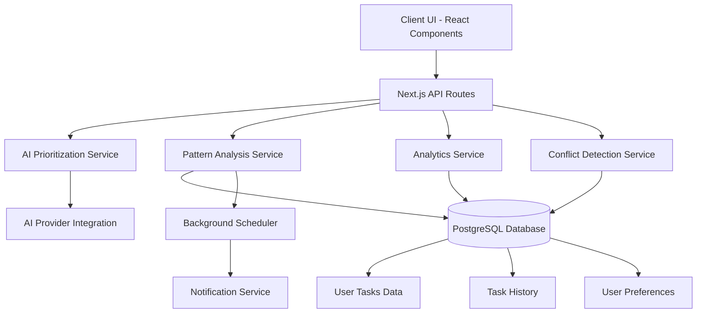
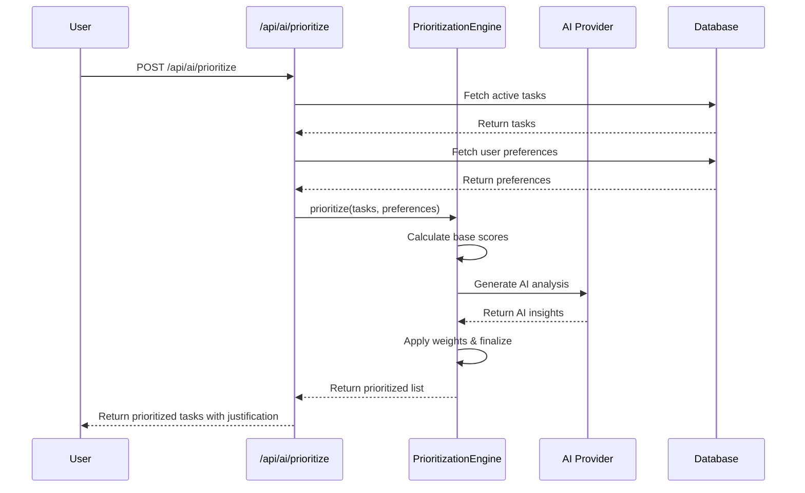
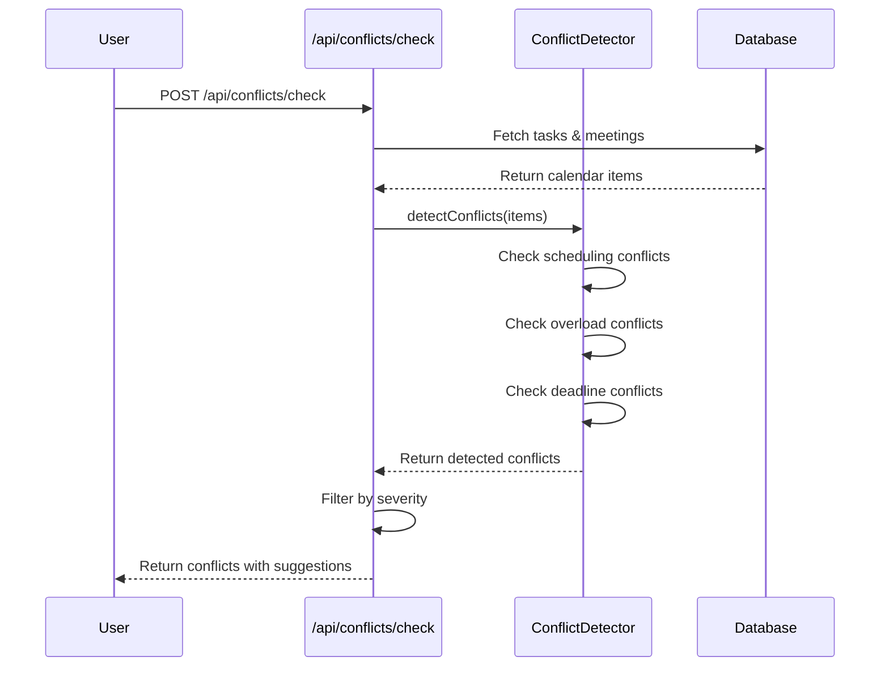

# Design: ai-task-prioritization

## 1. Architecture Overview

### 1.1 High-Level Architecture



### 1.2 Component Architecture

```mermaid
graph LR
    subgraph Frontend
        TaskList[TaskList Component]
        InsightsDashboard[Insights Dashboard]
        ConflictAlert[Conflict Alert Component]
        PatternSuggestion[Pattern Suggestion UI]
    end
    
    subgraph API Layer
        PrioritizeEndpoint[/api/ai/prioritize]
        InsightsEndpoint[/api/analytics/insights]
        ConflictEndpoint[/api/conflicts/check]
    end
    
    subgraph Services
        PrioritizationEngine[PrioritizationEngine]
        PatternAnalyzer[PatternAnalyzer]
        AnalyticsEngine[AnalyticsEngine]
        ConflictDetector[ConflictDetector]
    end
    
    subgraph Data Layer
        TaskRepository[TaskRepository]
        HistoryRepository[HistoryRepository]
        AnalyticsRepository[AnalyticsRepository]
    end
    
    TaskList --> PrioritizeEndpoint
    InsightsDashboard --> InsightsEndpoint
    ConflictAlert --> ConflictEndpoint
    PatternSuggestion --> PrioritizeEndpoint
    
    PrioritizeEndpoint --> PrioritizationEngine
    InsightsEndpoint --> AnalyticsEngine
    ConflictEndpoint --> ConflictDetector
    
    PrioritizationEngine --> TaskRepository
    PatternAnalyzer --> HistoryRepository
    AnalyticsEngine --> AnalyticsRepository
    ConflictDetector --> TaskRepository
```

## 2. Component Design

### 2.1 AI Prioritization Service

**Responsibilities:**
- Analyze task data and generate prioritized recommendations
- Integrate with AI provider for intelligent analysis
- Provide justification for prioritization decisions
- Handle time-based and complexity-based weighting

**Interfaces:**
```typescript
interface PrioritizationRequest {
  tasks: Task[];
  availableTime?: number; // in minutes
  preferences?: UserPreferences;
}

interface PrioritizationResponse {
  prioritizedTasks: PrioritizedTask[];
  justification: string;
  confidenceScore: number;
}

interface PrioritizedTask extends Task {
  priorityScore: number;
  rank: number;
  reasoning: string[];
}

class PrioritizationEngine {
  async prioritize(request: PrioritizationRequest): Promise<PrioritizationResponse>;
  private calculatePriorityScore(task: Task, context: AnalysisContext): number;
  private generateJustification(task: Task, score: number): string[];
}
```

### 2.2 Pattern Analysis Service

**Responsibilities:**
- Detect recurring patterns in task creation and completion
- Analyze user behavior and preferences
- Generate proactive suggestions
- Schedule periodic analysis runs

**Interfaces:**
```typescript
interface PatternAnalysisConfig {
  analysisInterval: number; // hours
  minPatternThreshold: number; // minimum occurrences to consider a pattern
}

interface DetectedPattern {
  type: 'recurring' | 'batch' | 'postponement' | 'performance';
  patternData: any;
  confidence: number;
  suggestion: PatternSuggestion;
}

interface PatternSuggestion {
  id: string;
  title: string;
  description: string;
  action: () => Promise<void>;
  impact: 'high' | 'medium' | 'low';
}

class PatternAnalyzer {
  async analyzePatterns(userId: string): Promise<DetectedPattern[]>;
  private detectRecurringPatterns(tasks: Task[]): RecurringPattern[];
  private detectBatchOpportunities(tasks: Task[]): BatchSuggestion[];
  private detectPostponementPatterns(tasks: Task[]): PostponementPattern[];
  private detectPerformancePatterns(history: TaskHistory[]): PerformancePattern[];
}
```

### 2.3 Analytics Service

**Responsibilities:**
- Generate productivity insights and metrics
- Create visualizations for dashboard
- Calculate performance indicators
- Store and retrieve historical analytics

**Interfaces:**
```typescript
interface AnalyticsRequest {
  userId: string;
  period: 'week' | 'month' | 'quarter';
  metrics: MetricType[];
}

interface ProductivityInsights {
  mostProductiveHours: TimeSlot[];
  taskCompletionByType: Record<string, number>;
  procrastinationPatterns: ProcrastinationPattern[];
  improvementSuggestions: string[];
  productivityScore: number;
  trend: 'improving' | 'declining' | 'stable';
}

class AnalyticsEngine {
  async generateInsights(request: AnalyticsRequest): Promise<ProductivityInsights>;
  private calculateProductivityScore(history: TaskHistory[]): number;
  private identifyProcrastinationPatterns(tasks: Task[]): ProcrastinationPattern[];
  private analyzeCompletionByType(tasks: Task[]): Record<string, number>;
}
```

### 2.4 Conflict Detection Service

**Responsibilities:**
- Detect scheduling conflicts in real-time
- Identify overload situations
- Provide immediate warnings and alternatives
- Monitor task and meeting schedules

**Interfaces:**
```typescript
interface ConflictDetectionRequest {
  userId: string;
  newItem?: Task | Meeting;
  timeframe?: {
    start: Date;
    end: Date;
  };
}

interface DetectedConflict {
  type: 'scheduling' | 'overload' | 'deadline';
  severity: 'critical' | 'warning' | 'info';
  description: string;
  conflictingItems: (Task | Meeting)[];
  suggestions: ConflictResolutionSuggestion[];
}

interface ConflictResolutionSuggestion {
  action: 'reschedule' | 'delegate' | 'breakdown' | 'extend';
  details: any;
  impact: 'high' | 'medium' | 'low';
}

class ConflictDetector {
  async detectConflicts(request: ConflictDetectionRequest): Promise<DetectedConflict[]>;
  private checkSchedulingConflicts(items: CalendarItem[]): SchedulingConflict[];
  private checkOverloadConflicts(tasks: Task[], meetings: Meeting[]): OverloadConflict[];
  private checkDeadlineConflicts(tasks: Task[], meetings: Meeting[]): DeadlineConflict[];
}
```

## 3. Data Models

### 3.1 Core Data Structures

```typescript
// Enhanced Task Model
interface Task {
  id: string;
  title: string;
  type: TaskType;
  dueDate?: Date;
  complexity: 'low' | 'medium' | 'high';
  estimatedDuration?: number; // in minutes
  completed: boolean;
  completedAt?: Date;
  createdAt: Date;
  userId: string;
  tags?: string[];
  priority?: number;
}

// AI Analysis Results
interface TaskAnalysis {
  taskId: string;
  priorityScore: number;
  factors: PriorityFactor[];
  recommendedOrder: number;
  confidence: number;
}

interface PriorityFactor {
  name: string;
  weight: number;
  impact: 'positive' | 'negative';
  description: string;
}

// User Performance Patterns
interface UserPerformancePattern {
  userId: string;
  patternType: 'peak_hours' | 'task_type_preference' | 'completion_rate';
  patternData: any;
  confidence: number;
  lastUpdated: Date;
}

// Historical Data for Analysis
interface TaskHistory {
  taskId: string;
  userId: string;
  action: 'created' | 'completed' | 'postponed' | 'rescheduled';
  timestamp: Date;
  context?: any;
}
```

### 3.2 Database Schema Extensions

```sql
-- Task analysis results table
CREATE TABLE task_analyses (
  id SERIAL PRIMARY KEY,
  task_id VARCHAR(255) NOT NULL,
  user_id VARCHAR(255) NOT NULL,
  priority_score DECIMAL(5,2),
  recommended_order INTEGER,
  confidence DECIMAL(3,2),
  factors JSONB,
  created_at TIMESTAMP DEFAULT NOW(),
  FOREIGN KEY (task_id) REFERENCES tasks(id),
  FOREIGN KEY (user_id) REFERENCES users(id)
);

-- User performance patterns table
CREATE TABLE user_performance_patterns (
  id SERIAL PRIMARY KEY,
  user_id VARCHAR(255) NOT NULL,
  pattern_type VARCHAR(50) NOT NULL,
  pattern_data JSONB NOT NULL,
  confidence DECIMAL(3,2),
  last_updated TIMESTAMP DEFAULT NOW(),
  FOREIGN KEY (user_id) REFERENCES users(id)
);

-- Pattern suggestions table
CREATE TABLE pattern_suggestions (
  id SERIAL PRIMARY KEY,
  user_id VARCHAR(255) NOT NULL,
  suggestion_type VARCHAR(50) NOT NULL,
  title TEXT NOT NULL,
  description TEXT NOT NULL,
  action_data JSONB,
  impact VARCHAR(10),
  is_accepted BOOLEAN DEFAULT FALSE,
  is_dismissed BOOLEAN DEFAULT FALSE,
  created_at TIMESTAMP DEFAULT NOW(),
  FOREIGN KEY (user_id) REFERENCES users(id)
);

-- Conflict detection log
CREATE TABLE detected_conflicts (
  id SERIAL PRIMARY KEY,
  user_id VARCHAR(255) NOT NULL,
  conflict_type VARCHAR(50) NOT NULL,
  severity VARCHAR(20) NOT NULL,
  description TEXT NOT NULL,
  conflicting_items JSONB,
  suggestions JSONB,
  is_resolved BOOLEAN DEFAULT FALSE,
  detected_at TIMESTAMP DEFAULT NOW(),
  FOREIGN KEY (user_id) REFERENCES users(id)
);
```

## 4. Business Process Flows

### 4.1 Task Prioritization Flow



### 4.2 Pattern Analysis Flow

```mermaid
flowchart TD
    A[Scheduled Analysis Trigger] --> B[PatternAnalyzer.analyzePatterns()]
    B --> C[Fetch User Tasks & History]
    C --> D{Pattern Detection}
    D -->|Recurring| E[Detect Recurring Patterns]
    D -->|Batch| F[Detect Batch Opportunities]
    D -->|Postponement| G[Detect Postponement Patterns]
    D -->|Performance| H[Detect Performance Patterns]
    E --> I[Generate Suggestions]
    F --> I
    G --> I
    H --> I
    I --> J[Filter by Confidence]
    J --> K[Store Suggestions]
    K --> L[Send Notifications]
```

### 4.3 Conflict Detection Flow



## 5. AI Integration Design

### 5.1 Prompt Engineering

```typescript
interface PrioritizationPrompt {
  system: string;
  user: string;
  schema: z.ZodSchema;
}

const prioritizationPrompt: PrioritizationPrompt = {
  system: `You are an expert task prioritization assistant. Analyze the given tasks and provide a prioritized list with detailed justification.
  
  Consider these factors (in order of importance):
  1. Due date urgency (tasks due sooner have higher priority)
  2. Complexity vs. available time (complex tasks need adequate time slots)
  3. User's historical performance patterns (when they work best on specific task types)
  4. Task type and category importance
  5. Estimated duration and time required
  
  Provide confidence scores and detailed reasoning for each prioritization decision.`,
  
  user: (tasks: Task[], preferences: UserPreferences) => `
  Analyze these tasks for user ${preferences.userId}:
  ${JSON.stringify(tasks)}
  
  User preferences and patterns:
  ${JSON.stringify(preferences)}
  
  Available time: ${preferences.availableTime} minutes
  
  Return a prioritized list with justification for each task.
  `,
  
  schema: z.object({
    prioritizedTasks: z.array(z.object({
      taskId: z.string(),
      priorityScore: z.number(),
      rank: z.number(),
      reasoning: z.array(z.string()),
      confidence: z.number()
    })),
    overallStrategy: z.string()
  })
};
```

### 5.2 Token Optimization Strategy

- Use structured output schemas to minimize token usage
- Cache frequent analysis patterns
- Batch multiple tasks in single AI calls
- Implement fallback to rule-based prioritization if AI fails
- Monitor token usage and costs per user

## 6. Error Handling Strategy

### 6.1 Error Types and Handling

```typescript
enum AIPrioritizationError {
  AI_PROVIDER_ERROR = 'AI_PROVIDER_ERROR',
  INVALID_TASK_DATA = 'INVALID_TASK_DATA',
  RATE_LIMIT_EXCEEDED = 'RATE_LIMIT_EXCEEDED',
  TIMEOUT = 'TIMEOUT',
  SCHEMA_VALIDATION_FAILED = 'SCHEMA_VALIDATION_FAILED'
}

interface ErrorHandlingStrategy {
  [AIPrioritizationError.AI_PROVIDER_ERROR]: {
    fallback: 'rule_based_prioritization',
    retry: true,
    maxRetries: 3
  };
  [AIPrioritizationError.INVALID_TASK_DATA]: {
    fallback: 'return_error',
    retry: false,
    validation: true
  };
  [AIPrioritizationError.RATE_LIMIT_EXCEEDED]: {
    fallback: 'queue_request',
    retry: true,
    backoff: 'exponential'
  };
}
```

### 6.2 Fallback Mechanisms

1. **AI Failure Fallback**: Rule-based prioritization using predefined weights
2. **Database Unavailability**: Cache recent analyses and return stale data
3. **Timeout Handling**: Partial results with indication of incomplete analysis
4. **Validation Errors**: Detailed error messages with field-level feedback

## 7. Testing Strategy

### 7.1 Unit Tests

```typescript
describe('PrioritizationEngine', () => {
  test('should prioritize tasks by due date urgency');
  test('should consider available time in prioritization');
  test('should handle tasks without due dates');
  test('should apply user preferences correctly');
  test('should generate valid justification for each task');
});

describe('PatternAnalyzer', () => {
  test('should detect recurring task patterns');
  test('should identify batch processing opportunities');
  test('should detect procrastination patterns');
  test('should calculate confidence scores accurately');
});
```

### 7.2 Integration Tests

```typescript
describe('AI Prioritization API', () => {
  test('POST /api/ai/prioritize should return prioritized tasks');
  test('should handle AI provider errors gracefully');
  test('should validate input data and return appropriate errors');
  test('should respect rate limiting');
});

describe('Pattern Analysis Workflow', () => {
  test('should detect patterns and generate suggestions');
  test('should store suggestions in database');
  test('should send notifications for high-impact suggestions');
});
```

### 7.3 Performance Tests

- Prioritization endpoint: < 3 seconds for 50 tasks
- Pattern analysis: < 5 seconds for 1000 historical tasks
- Dashboard loading: < 2 seconds for 30 days of data
- Conflict detection: < 1 second for real-time checking

## 8. Security Considerations

### 8.1 Data Privacy
- All task data stays within the user's account
- AI provider integration uses secure API keys
- No sensitive data is logged or stored unnecessarily
- User preferences are encrypted at rest

### 8.2 Rate Limiting
- Per-user rate limits on AI endpoints
- Global rate limits to prevent AI provider overuse
- Cost monitoring and alerts for unusual usage patterns

### 8.3 Input Validation
- Strict validation of all user inputs
- SQL injection prevention through parameterized queries
- XSS prevention through proper output encoding

## 9. Deployment Considerations

### 9.1 Environment Variables
```bash
# AI Provider Configuration
AI_PROVIDER=openai # or anthropic, google
AI_API_KEY=sk-...
AI_MODEL=gpt-4-turbo-preview

# Feature Flags
ENABLE_AI_PRIORITIZATION=true
ENABLE_PATTERN_ANALYSIS=true
ENABLE_CONFLICT_DETECTION=true

# Performance Tuning
PRIORITIZATION_TIMEOUT=3000
PATTERN_ANALYSIS_INTERVAL=4 # hours
MAX_TASKS_PER_ANALYSIS=100
```

### 9.2 Migration Strategy
1. Deploy database schema changes
2. Deploy backend services
3. Enable feature flags for beta users
4. Monitor performance and error rates
5. Gradual rollout to all users

### 9.3 Monitoring
- AI provider latency and error rates
- Token usage and costs per user
- User adoption rates for AI features
- Performance metrics for each endpoint
- User feedback and suggestion acceptance rates