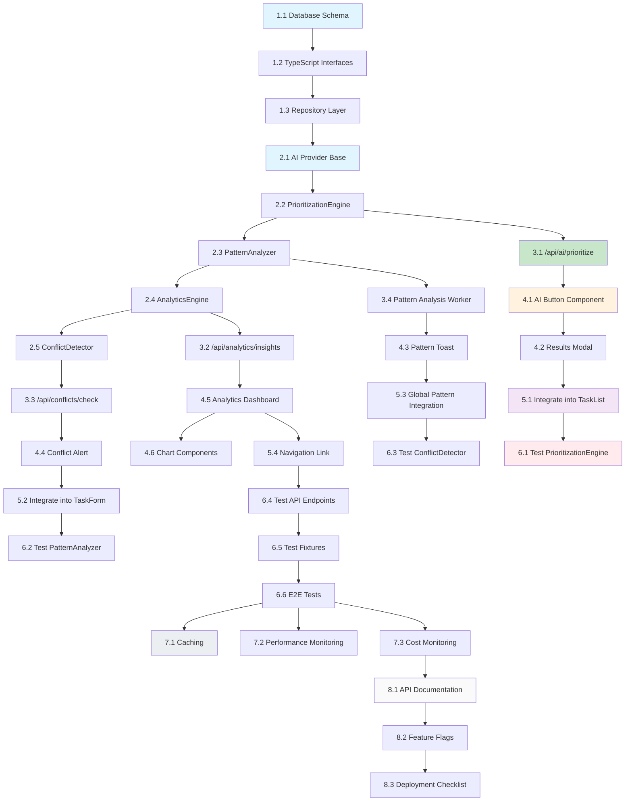

# Tasks: ai-task-prioritization

## Implementation Plan

Convert the feature design into a series of prompts for a code-generation LLM that will implement each step in a test-driven manner. Prioritize best practices, incremental progress, and early testing, ensuring no big jumps in complexity at any stage. Make sure that each prompt builds on the previous prompts, and ends with wiring things together. There should be no hanging or orphaned code that isn't integrated into a previous step. Focus ONLY on tasks that involve writing, modifying, or testing code.

---

## Phase 1: Foundation & Database Schema

### 1.1. Create database schema extensions for AI task analysis
- **Priority**: High
- **Dependencies**: None
- **Files**: 
  - `src/db/schema.ts` (add new tables using Drizzle ORM)
- **Acceptance**: 
  - Add schema definitions in `src/db/schema.ts` for:
    - `task_analyses` table
    - `user_performance_patterns` table
    - `pattern_suggestions` table
    - `detected_conflicts` table
  - Foreign key relationships properly defined using Drizzle relations
  - Run `npm run db:generate` to create migration files
  - Run `npm run db:migrate` to apply migrations
  - Schema types automatically inferred by Drizzle
- **Note**: Use Drizzle ORM patterns as existing in the project, do not create manual SQL files
- **Requirements**: 3.3, 3.4

### 1.2. Create TypeScript interfaces for AI prioritization data models
- **Priority**: High
- **Dependencies**: 1.1
- **Files**:
  - `src/types/ai-prioritization.ts` (new file)
  - `src/types/index.ts` (update exports)
- **Acceptance**:
  - Interfaces defined: PrioritizationRequest, PrioritizationResponse, PrioritizedTask, TaskAnalysis, PriorityFactor
  - Interfaces defined: DetectedPattern, PatternSuggestion, UserPerformancePattern
  - Interfaces defined: DetectedConflict, ConflictResolutionSuggestion
  - All interfaces properly typed with Zod schemas for validation
- **Requirements**: 3.3

### 1.3. Create repository layer for AI analysis data access
- **Priority**: High
- **Dependencies**: 1.2
- **Files**:
  - `src/services/database/taskAnalysisRepository.ts` (new file)
  - `src/services/database/patternRepository.ts` (new file)
  - `src/services/database/conflictRepository.ts` (new file)
- **Acceptance**:
  - Repository classes with CRUD operations for all new tables
  - Methods for querying user-specific data
  - Proper error handling and type safety
  - Unit tests for repository methods
- **Requirements**: 3.3, 4.3

---

## Phase 2: Core AI Services Implementation

### 2.1. Implement AI provider integration using existing AI SDK
- **Priority**: High
- **Dependencies**: 1.3
- **Files**:
  - `src/services/ai/aiProvider.ts` (new file)
- **Acceptance**:
  - Use existing AI SDK packages (@ai-sdk/openai, @ai-sdk/google, etc.)
  - Import and use `generateObject` from 'ai' package
  - Support for OpenAI, Anthropic, and Google providers
  - Configurable model selection via environment variables
  - Error handling and retry logic
  - Token usage tracking
- **Note**: Project already has AI SDK installed. Do not create new abstractions, use the existing `ai` and `@ai-sdk/*` packages
- **Requirements**: 3.2

### 2.2. Implement PrioritizationEngine service
- **Priority**: High
- **Dependencies**: 2.1
- **Files**:
  - `src/services/ai/prioritizationEngine.ts` (new file)
- **Acceptance**:
  - prioritize() method that orchestrates the prioritization process
  - calculatePriorityScore() with rule-based scoring
  - generateJustification() for explaining decisions
  - Integration with AI provider for enhanced analysis
  - Fallback to rule-based when AI fails
- **Requirements**: 2.1, 3.2

### 2.3. Implement PatternAnalyzer service
- **Priority**: High
- **Dependencies**: 2.2
- **Files**:
  - `src/services/ai/patternAnalyzer.ts` (new file)
- **Acceptance**:
  - analyzePatterns() method for pattern detection
  - detectRecurringPatterns() for identifying recurring tasks
  - detectBatchOpportunities() for batch processing suggestions
  - detectPostponementPatterns() for procrastination identification
  - detectPerformancePatterns() for user performance analysis
  - Confidence scoring for all pattern detections
- **Requirements**: 2.2

### 2.4. Implement AnalyticsEngine service
- **Priority**: High
- **Dependencies**: 2.3
- **Files**:
  - `src/services/analytics/analyticsEngine.ts` (new file)
- **Acceptance**:
  - generateInsights() method for productivity analytics
  - calculateProductivityScore() based on historical data
  - identifyProcrastinationPatterns() analysis
  - analyzeCompletionByType() for task type breakdown
  - Support for week/month/quarter periods
- **Requirements**: 2.3

### 2.5. Implement ConflictDetector service
- **Priority**: High
- **Dependencies**: 2.4
- **Files**:
  - `src/services/ai/conflictDetector.ts` (new file)
- **Acceptance**:
  - detectConflicts() method for real-time conflict detection
  - checkSchedulingConflicts() for meeting overlaps
  - checkOverloadConflicts() for too many complex tasks
  - checkDeadlineConflicts() for deadline vs schedule conflicts
  - Generate resolution suggestions for each conflict
- **Requirements**: 2.4

---

## Phase 3: API Endpoints Implementation

### 3.1. Create POST /api/ai/prioritize endpoint
- **Priority**: High
- **Dependencies**: 2.2
- **Files**:
  - `src/app/api/ai/prioritize/route.ts` (new file)
- **Acceptance**:
  - Accepts JSON body with tasks array and optional preferences
  - Validates input using Zod schemas
  - Calls PrioritizationEngine.prioritize()
  - Returns prioritized tasks with justification
  - Handles errors with appropriate HTTP status codes
  - Rate limiting implemented
- **Requirements**: 3.4, 4.3

### 3.2. Create GET /api/analytics/insights endpoint
- **Priority**: High
- **Dependencies**: 2.4
- **Files**:
  - `src/app/api/analytics/insights/route.ts` (new file)
- **Acceptance**:
  - Accepts query parameters for period (week/month/quarter)
  - Authenticates and authorizes user
  - Calls AnalyticsEngine.generateInsights()
  - Returns productivity insights and metrics
  - Caches results for performance
- **Requirements**: 3.4, 4.3

### 3.3. Create POST /api/conflicts/check endpoint
- **Priority**: High
- **Dependencies**: 2.5
- **Files**:
  - `src/app/api/conflicts/check/route.ts` (new file)
- **Acceptance**:
  - Accepts new task/meeting data for conflict checking
  - Calls ConflictDetector.detectConflicts()
  - Returns detected conflicts with suggestions
  - Real-time processing (< 1 second)
  - WebSocket support for live updates
- **Requirements**: 3.4, 4.3

### 3.4. Create background worker for pattern analysis
- **Priority**: Medium
- **Dependencies**: 2.3
- **Files**:
  - `src/services/ai/patternAnalysisWorker.ts` (new file)
  - `src/app/api/cron/analyze-patterns/route.ts` (new file)
- **Acceptance**:
  - Scheduled execution every 4 hours (configurable)
  - Processes all users or only active ones
  - Generates pattern suggestions
  - Stores results in database
  - Sends notifications for high-impact suggestions
- **Note**: Next.js doesn't have native cron job support. Use Vercel Cron Jobs (vercel.json config) or external scheduler like AWS EventBridge. The API route will be triggered by the scheduler.
- **Requirements**: 2.2

---

## Phase 4: Frontend Components

### 4.1. Create AI Prioritization Button Component
- **Priority**: High
- **Dependencies**: 3.1
- **Files**:
  - `src/components/ai/AIPrioritizationButton.tsx` (new file)
- **Acceptance**:
  - Button to trigger AI prioritization
  - Loading states while processing
  - Success/error feedback
  - Integration with existing task list
  - Responsive design
- **Requirements**: 2.1

### 4.2. Create Prioritization Results Modal/Panel
- **Priority**: High
- **Dependencies**: 4.1
- **Files**:
  - `src/components/ai/PrioritizationResults.tsx` (new file)
- **Acceptance**:
  - Display prioritized task list
  - Show justification for each task
  - Allow user to accept/reorder suggestions
  - Visual indicators for priority levels
  - Smooth animations and transitions
- **Requirements**: 2.1

### 4.3. Create Pattern Suggestion Toast/Notification Component
- **Priority**: High
- **Dependencies**: 3.4
- **Files**:
  - `src/components/ai/PatternSuggestionToast.tsx` (new file)
- **Acceptance**:
  - Display proactive pattern suggestions
  - Allow one-click implementation
  - Dismissible with "remind me later"
  - Non-intrusive design
  - Stacking for multiple suggestions
- **Requirements**: 2.2

### 4.4. Create Conflict Alert Banner Component
- **Priority**: High
- **Dependencies**: 3.3
- **Files**:
  - `src/components/ai/ConflictAlertBanner.tsx` (new file)
- **Acceptance**:
  - Real-time conflict detection display
  - Severity-based styling (critical/warning/info)
  - Show conflict details and suggestions
  - Auto-dismiss after resolution
  - Integration with task/meeting forms
- **Requirements**: 2.4

### 4.5. Create Productivity Insights Dashboard Page
- **Priority**: High
- **Dependencies**: 3.2
- **Files**:
  - `src/app/analytics/page.tsx` (new file)
  - `src/components/analytics/InsightsDashboard.tsx` (new file)
- **Acceptance**:
  - Weekly and monthly view tabs
  - Charts for productive hours, task types
  - Procrastination pattern visualization
  - Personalized improvement suggestions
  - Export/share functionality
- **Requirements**: 2.3

### 4.6. Create Analytics Chart Components
- **Priority**: Medium
- **Dependencies**: 4.5
- **Files**:
  - `src/components/analytics/ProductivityChart.tsx` (new file)
  - `src/components/analytics/TaskTypeBreakdown.tsx` (new file)
  - `src/components/analytics/ProcrastinationHeatmap.tsx` (new file)
- **Acceptance**:
  - Reusable chart components using Recharts or similar
  - Responsive and interactive
  - Loading states and error handling
  - Accessible with proper ARIA labels
- **Requirements**: 2.3

---

## Phase 5: Integration & Wiring

### 5.1. Integrate AI prioritization into TaskList component
- **Priority**: High
- **Dependencies**: 4.2
- **Files**:
  - `src/components/TaskList.tsx` (modify)
- **Acceptance**:
  - Add AI prioritization button to task list header
  - Update task order based on AI suggestions
  - Visual feedback during reordering
  - Persist user acceptance of suggestions
- **Requirements**: 2.1

### 5.2. Integrate conflict detection into TaskForm
- **Priority**: High
- **Dependencies**: 4.4
- **Files**:
  - `src/components/TaskForm.tsx` (modify)
- **Acceptance**:
  - Real-time conflict checking as user types
  - Display warnings before form submission
  - Suggest alternative dates/times
  - Prevent submission of conflicting tasks
- **Requirements**: 2.4

### 5.3. Add pattern suggestion integration to main layout
- **Priority**: High
- **Dependencies**: 4.3
- **Files**:
  - `src/app/layout.tsx` (modify)
  - `src/components/LayoutWrapper.tsx` (new file)
- **Acceptance**:
  - Pattern suggestions appear globally in app
  - Positioned to not interfere with main content
  - Respect user notification preferences
  - Dismissal state persisted
- **Requirements**: 2.2

### 5.4. Add navigation link to analytics dashboard
- **Priority**: Medium
- **Dependencies**: 4.5
- **Files**:
  - `src/components/Navigation.tsx` (modify)
- **Acceptance**:
  - New nav item for "Analytics" or "Insights"
  - Icon representing analytics/charts
  - Active state styling
  - Mobile responsive
- **Requirements**: 2.3

---

## Phase 6: Testing & Validation

### 6.1. Write unit tests for PrioritizationEngine
- **Priority**: High
- **Dependencies**: 2.2
- **Files**:
  - `src/services/ai/__tests__/prioritizationEngine.test.ts` (new file)
- **Acceptance**:
  - Test priority score calculation
  - Test due date urgency weighting
  - Test available time consideration
  - Test AI integration fallback
  - Test justification generation
- **Requirements**: 4.3

### 6.2. Write unit tests for PatternAnalyzer
- **Priority**: High
- **Dependencies**: 2.3
- **Files**:
  - `src/services/ai/__tests__/patternAnalyzer.test.ts` (new file)
- **Acceptance**:
  - Test recurring pattern detection
  - Test batch opportunity detection
  - Test postponement pattern detection
  - Test performance pattern detection
  - Test confidence scoring
- **Requirements**: 4.3

### 6.3. Write unit tests for ConflictDetector
- **Priority**: High
- **Dependencies**: 2.5
- **Files**:
  - `src/services/ai/__tests__/conflictDetector.test.ts` (new file)
- **Acceptance**:
  - Test scheduling conflict detection
  - Test overload conflict detection
  - Test deadline conflict detection
  - Test suggestion generation
  - Test edge cases (empty calendars, all-day events)
- **Requirements**: 4.3

### 6.4. Write integration tests for API endpoints
- **Priority**: High
- **Dependencies**: 3.1, 3.2, 3.3
- **Files**:
  - `src/app/api/ai/prioritize/__tests__/route.test.ts` (new file)
  - `src/app/api/analytics/insights/__tests__/route.test.ts` (new file)
  - `src/app/api/conflicts/check/__tests__/route.test.ts` (new file)
- **Acceptance**:
  - Test full request/response cycle
  - Test authentication and authorization
  - Test error handling and status codes
  - Test rate limiting
  - Test validation errors
- **Requirements**: 4.3

### 6.5. Create test fixtures and mocks
- **Priority**: Medium
- **Dependencies**: 6.1
- **Files**:
  - `src/test/fixtures/tasks.ts` (new file)
  - `src/test/fixtures/patterns.ts` (new file)
  - `src/test/mocks/aiProvider.ts` (new file)
- **Acceptance**:
  - Realistic test data for tasks, patterns, conflicts
  - Mock AI provider responses
  - Reusable test helpers
  - Type-safe fixtures
- **Requirements**: 4.3

### 6.6. Run end-to-end test scenarios
- **Priority**: Medium
- **Dependencies**: 5.1, 5.2, 5.3, 5.4
- **Files**:
  - `e2e/ai-prioritization.spec.ts` (new file)
- **Acceptance**:
  - Test complete prioritization flow
  - Test pattern suggestion acceptance
  - Test conflict detection and resolution
  - Test dashboard loading and visualization
  - All tests passing in CI environment
- **Requirements**: 4.1, 4.2

---

## Phase 7: Performance Optimization & Monitoring

### 7.1. Implement caching for analytics data
- **Priority**: Medium
- **Dependencies**: 2.4
- **Files**:
  - `src/lib/cache/analyticsCache.ts` (new file)
- **Acceptance**:
  - Use Next.js App Router caching (unstable_cache) or in-memory cache
  - Cache analytics results for 1 hour
  - Invalidate cache on new task completion
  - Cache hit/miss metrics
- **Note**: Redis is not configured in the project. Use Next.js built-in caching mechanisms or implement in-memory cache. Only add Redis if absolutely necessary with proper setup.
- **Requirements**: 3.1

### 7.2. Add performance monitoring
- **Priority**: Medium
- **Dependencies**: 3.1, 3.2, 3.3
- **Files**:
  - `src/services/monitoring/performance.ts` (modify)
- **Acceptance**:
  - Track API endpoint response times
  - Track AI provider latency
  - Track database query performance
  - Set up alerts for slow endpoints
- **Requirements**: 3.1

### 7.3. Implement cost monitoring for AI usage
- **Priority**: Medium
- **Dependencies**: 2.1
- **Files**:
  - `src/services/monitoring/aiCost.ts` (new file)
- **Acceptance**:
  - Track token usage per user
  - Track cost per AI call
  - Daily/weekly cost summaries
  - Alerts when approaching budget limits
- **Requirements**: 3.2

---

## Phase 8: Documentation & Deployment

### 8.1. Write API documentation
- **Priority**: Low
- **Dependencies**: 3.1, 3.2, 3.3
- **Files**:
  - `docs/api/ai-prioritization.md` (new file)
- **Acceptance**:
  - Endpoint descriptions and parameters
  - Request/response examples
  - Error codes and handling
  - Authentication requirements
- **Requirements**: 4.3

### 8.2. Create feature flag configuration
- **Priority**: Low
- **Dependencies**: All phases
- **Files**:
  - `src/config/features.ts` (new file)
- **Acceptance**:
  - Feature flags for each AI feature
  - Environment-based configuration
  - User-based rollout capability
  - Admin controls for feature toggling
- **Requirements**: 5.0

### 8.3. Prepare deployment checklist
- **Priority**: Low
- **Dependencies**: All phases
- **Files**:
  - `docs/deployment/ai-features.md` (new file)
- **Acceptance**:
  - Database migration steps
  - Environment variable setup
  - Feature flag configuration
  - Monitoring and alerting setup
  - Rollback procedures
- **Requirements**: 6.0

---

## Task Dependency Diagram

---

## Total Tasks: 35

**Estimated Time**: 40-50 hours
**Success Metrics**:
- All 35 tasks completed with acceptance criteria met
- Code coverage > 80% for new code
- All API endpoints responding in < 3 seconds
- Zero critical bugs in production
- User acceptance testing passed with > 4.0/5.0 rating
<!-- ORCHESTRATOR-TASKS-SYNC START -->
## Orchestrator Task Status

- (Nenhuma tarefa cadastrada no estado atual)
<!-- ORCHESTRATOR-TASKS-SYNC END -->

