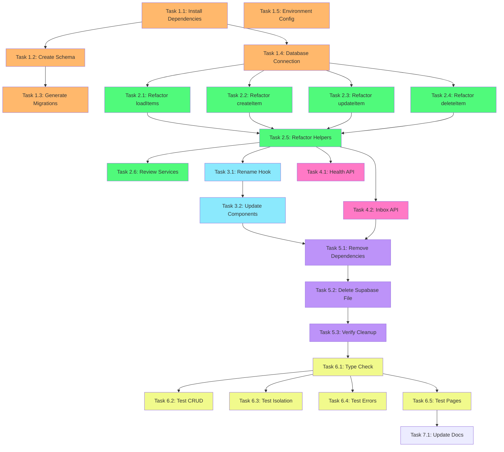

# Implementation Plan: Supabase to Neon Migration

## Phase 1: Foundation Setup

### Task 1.1: Install Dependencies and Configure Drizzle

**Description:** Install Drizzle ORM, Neon driver, and configure the project for database migrations.

**Files:**
- `package.json`
- `drizzle.config.ts` (create)

**Steps:**
1. Install drizzle-orm and @neondatabase/serverless
2. Install drizzle-kit as dev dependency
3. Create drizzle.config.ts with Neon driver configuration
4. Add npm scripts for db:generate, db:migrate, db:studio

**Acceptance:**
- package.json includes drizzle-orm and @neondatabase/serverless
- drizzle.config.ts exists and points to correct schema path
- npm scripts are available for migration management

**Requirements:** 2.1, 2.2, 2.3

---

### Task 1.2: Create Database Schema Definitions

**Description:** Define all database tables using Drizzle ORM schema syntax with proper types, defaults, and relations.

**Files:**
- `src/db/schema.ts` (create)

**Steps:**
1. Create src/db directory
2. Define mindFlowItems table with all columns matching requirements
3. Define subtasks table with foreign key to mindFlowItems
4. Define mcpServerConfigs table
5. Add relations between tables
6. Export TypeScript types using $inferSelect and $inferInsert

**Acceptance:**
- mindFlowItems table has all required columns (id, user_id, title, completed, created_at, updated_at, summary, item_type, due_date, due_date_iso, suggestions, is_generating_subtasks, transaction_type, amount, is_recurring, payment_method, is_paid, chat_history, meeting_details, transcript, notes)
- subtasks table has foreign key to mindFlowItems with CASCADE delete
- mcpServerConfigs table has all required columns
- Types are exported for TypeScript usage
- Relations are properly defined

**Requirements:** 4.1, 4.2, 4.3, 4.4, 4.5, 4.6

---

### Task 1.3: Generate and Create Database Migrations

**Description:** Generate SQL migration files using Drizzle Kit and create index migration.

**Files:**
- `drizzle/migrations/0000_create_mind_flow_items.sql` (create)
- `drizzle/migrations/0001_create_subtasks.sql` (create)
- `drizzle/migrations/0002_create_mcp_server_configs.sql` (create)
- `drizzle/migrations/0003_add_indexes.sql` (create)

**Steps:**
1. Run npm run db:generate to create migration files from schema
2. Create additional migration file for indexes
3. Add indexes for user_id, created_at, item_type, parent_item_id
4. Verify migration SQL syntax is correct

**Acceptance:**
- Migration files exist in drizzle/migrations directory
- mind_flow_items table migration includes all columns
- subtasks table migration includes CASCADE foreign key
- mcp_server_configs table migration is complete
- Index migration creates indexes on user_id, created_at, item_type, parent_item_id

**Requirements:** 3.1, 3.2, 3.3, 3.4, 3.5, 3.6

---

### Task 1.4: Create Database Connection Module

**Description:** Set up Neon database connection with Drizzle ORM and connection pooling.

**Files:**
- `src/lib/db.ts` (create)

**Steps:**
1. Import drizzle and Pool from Neon serverless
2. Import schema from src/db/schema
3. Validate DATABASE_URL environment variable exists
4. Create Pool instance with connection string
5. Export configured db instance with schema

**Acceptance:**
- src/lib/db.ts exports a configured db instance
- Connection uses Pool for performance
- Throws error if DATABASE_URL is not set
- Schema is passed to drizzle configuration

**Requirements:** 2.4, 2.5

---

### Task 1.5: Update Environment Configuration

**Description:** Update environment variable configuration files to include DATABASE_URL and remove Supabase variables.

**Files:**
- `.env.example` (create/update)
- `vercel.json` (update)

**Steps:**
1. Create or update .env.example with DATABASE_URL
2. Add comment explaining Neon connection string format
3. Remove NEXT_PUBLIC_SUPABASE_URL from vercel.json
4. Remove NEXT_PUBLIC_SUPABASE_ANON_KEY from vercel.json
5. Add DATABASE_URL to vercel.json environment variables

**Acceptance:**
- .env.example includes DATABASE_URL with example format
- vercel.json does not reference Supabase environment variables
- vercel.json includes DATABASE_URL in env section

**Requirements:** 1.5, 10.1, 10.2, 10.4

---

## Phase 2: Service Layer Migration

### Task 2.1: Refactor ItemsService.loadItems

**Description:** Refactor the loadItems method to use Drizzle ORM query syntax with relations.

**Files:**
- `src/services/database/items.ts`

**Steps:**
1. Replace supabase import with db import from @/lib/db
2. Import schema types (mindFlowItems, subtasks)
3. Replace Supabase select query with db.query.mindFlowItems.findMany
4. Use with: { subtasks: true } for relation loading
5. Use where: eq(mindFlowItems.userId, userId) for filtering
6. Use orderBy: [desc(mindFlowItems.createdAt)] for sorting
7. Update error handling to work with Drizzle errors
8. Maintain existing logger integration

**Acceptance:**
- loadItems uses Drizzle query syntax
- Queries filter by userId
- Subtasks are loaded via relations
- Results are ordered by createdAt descending
- Error handling preserves existing logger calls
- No imports from @supabase packages

**Requirements:** 5.1, 5.2, 5.6

---

### Task 2.2: Refactor ItemsService.createItem

**Description:** Refactor the createItem method to use Drizzle insert syntax with returning clause.

**Files:**
- `src/services/database/items.ts`

**Steps:**
1. Replace Supabase insert with db.insert(mindFlowItems).values()
2. Map MindFlowItem fields to database column names
3. Use .returning() to get inserted row
4. Handle subtasks insertion if provided
5. Use db.insert(subtasks).values() for subtask creation
6. Map response back to MindFlowItem type
7. Update error handling

**Acceptance:**
- createItem uses Drizzle insert syntax
- Returns created item with all fields
- Subtasks are created if provided in input
- Error handling maintains logger integration
- Column name mapping is correct (camelCase to snake_case)

**Requirements:** 5.1, 5.3, 5.6

---

### Task 2.3: Refactor ItemsService.updateItem

**Description:** Refactor the updateItem method to use Drizzle update syntax.

**Files:**
- `src/services/database/items.ts`

**Steps:**
1. Replace Supabase update with db.update(mindFlowItems).set()
2. Use where: eq(mindFlowItems.id, itemId) for filtering
3. Map partial MindFlowItem updates to database columns
4. Handle subtasks update (delete old, insert new)
5. Use db.delete(subtasks).where() to clear existing subtasks
6. Use db.insert(subtasks).values() to add new subtasks
7. Update error handling

**Acceptance:**
- updateItem uses Drizzle update syntax
- Correctly filters by item ID
- Handles partial updates
- Subtasks are replaced correctly when provided
- Error handling maintains logger integration

**Requirements:** 5.1, 5.4, 5.6

---

### Task 2.4: Refactor ItemsService.deleteItem

**Description:** Refactor the deleteItem method to use Drizzle delete syntax.

**Files:**
- `src/services/database/items.ts`

**Steps:**
1. Replace Supabase delete with db.delete(mindFlowItems)
2. Use where: eq(mindFlowItems.id, itemId) for filtering
3. Verify CASCADE delete handles subtasks automatically
4. Update error handling

**Acceptance:**
- deleteItem uses Drizzle delete syntax
- Correctly filters by item ID
- Subtasks are deleted automatically via CASCADE
- Error handling maintains logger integration

**Requirements:** 5.1, 5.5, 5.6

---

### Task 2.5: Refactor ItemsService Helper Methods

**Description:** Refactor toggleItem, clearCompleted, setDueDate, and other helper methods to use Drizzle.

**Files:**
- `src/services/database/items.ts`

**Steps:**
1. Refactor toggleItem to use Drizzle select + update
2. Refactor clearCompleted to use Drizzle delete with and() conditions
3. Refactor setDueDate to use Drizzle update
4. Update mapToMindFlowItem if needed for Drizzle result format
5. Refactor createSubtasks helper to use Drizzle insert
6. Remove isSupabaseConfigured check and related code
7. Update error handling methods

**Acceptance:**
- All helper methods use Drizzle syntax
- toggleItem correctly flips completed status
- clearCompleted deletes only completed items for user
- setDueDate updates both due_date and due_date_iso
- No Supabase-specific code remains

**Requirements:** 5.1, 5.6, 5.7

---

### Task 2.6: Review and Update Database Service Files

**Description:** Review data-validator, performance-monitor, and maintenance-scheduler services to determine if they should be updated or removed.

**Files:**
- `src/services/database/data-validator.ts`
- `src/services/database/performance-monitor.ts`
- `src/services/database/maintenance-scheduler.ts`

**Steps:**
1. Read each service file to understand purpose
2. Determine if service is Supabase-specific or provides general value
3. If Supabase-specific, delete the file
4. If generally useful, refactor to use Drizzle ORM
5. Update imports and query syntax as needed
6. Document decision for each file

**Acceptance:**
- Each service file is either updated to use Drizzle or deleted
- No imports from @supabase packages remain
- Decision is documented for each file (in commit message or comment)

**Requirements:** 6.1, 6.2, 6.3, 6.4, 6.5

---

## Phase 3: Frontend Integration

### Task 3.1: Rename and Update useSupabaseItems Hook

**Description:** Rename useSupabaseItems to useItems and update all references and comments.

**Files:**
- `src/hooks/useSupabaseItems.ts` (rename to `src/hooks/useItems.ts`)

**Steps:**
1. Rename file from useSupabaseItems.ts to useItems.ts
2. Rename exported function from useSupabaseItems to useItems
3. Update all internal comments referencing Supabase
4. Update logger context from 'useSupabaseItems' to 'useItems'
5. Verify ItemsService import path is correct
6. Ensure Clerk useUser hook import remains unchanged

**Acceptance:**
- File is renamed to useItems.ts
- Exported hook is named useItems
- No comments reference Supabase
- Logger calls use 'useItems' context
- Hook functionality remains unchanged

**Requirements:** 7.1, 7.2, 7.3, 7.4

---

### Task 3.2: Update Component Imports

**Description:** Update all components that import useSupabaseItems to use the new useItems hook.

**Files:**
- `src/components/App.tsx`
- Any other components importing the hook

**Steps:**
1. Find all imports of useSupabaseItems using grep/search
2. Update import statement to use useItems from @/hooks/useItems
3. Update hook usage in component code
4. Verify no other Supabase-specific imports remain in components

**Acceptance:**
- App.tsx imports useItems instead of useSupabaseItems
- All other components are updated
- No imports from @supabase packages in component files
- Application compiles without import errors

**Requirements:** 7.5

---

## Phase 4: API Routes Migration

### Task 4.1: Update Health Check API Route

**Description:** Update the debug health API route to use Drizzle for database health checks.

**Files:**
- `src/app/api/debug/health/route.ts`

**Steps:**
1. Remove Supabase createClient import
2. Import db from @/lib/db
3. Import mindFlowItems from @/db/schema
4. Import sql from drizzle-orm
5. Replace Supabase count query with Drizzle count query
6. Update error handling to work with Drizzle errors
7. Maintain Clerk auth import and usage

**Acceptance:**
- No imports from @supabase packages
- Uses Drizzle to query database for health check
- Returns count of items or similar metric
- Error handling works correctly
- Clerk authentication remains functional

**Requirements:** 8.1, 8.3

---

### Task 4.2: Update Inbox Analyze API Route

**Description:** Update the inbox analyze route to use ItemsService instead of direct Supabase calls.

**Files:**
- `src/app/api/inbox/analyze/route.ts`

**Steps:**
1. Remove any direct Supabase createClient usage
2. Import ItemsService if not already imported
3. Replace Supabase queries with ItemsService method calls
4. Ensure userId is obtained from Clerk auth
5. Update error handling
6. Verify response format remains unchanged

**Acceptance:**
- No direct Supabase client usage
- Uses ItemsService for database operations
- Clerk auth provides userId
- API response format unchanged
- Error handling works correctly

**Requirements:** 8.2, 8.3, 8.4

---

## Phase 5: Cleanup

### Task 5.1: Remove Supabase Dependencies from package.json

**Description:** Uninstall Supabase npm packages and remove from package.json.

**Files:**
- `package.json`
- `package-lock.json`

**Steps:**
1. Run npm uninstall @supabase/supabase-js
2. Run npm uninstall @supabase/auth-helpers-nextjs
3. Verify packages are removed from package.json dependencies
4. Verify packages are removed from package-lock.json

**Acceptance:**
- package.json does not include @supabase/supabase-js
- package.json does not include @supabase/auth-helpers-nextjs
- package-lock.json does not include Supabase packages
- npm install runs successfully

**Requirements:** 1.1, 1.2

---

### Task 5.2: Delete Supabase Library File

**Description:** Remove the Supabase client configuration file.

**Files:**
- `src/lib/supabase.ts` (delete)

**Steps:**
1. Verify no files import from src/lib/supabase.ts
2. Delete src/lib/supabase.ts file
3. Verify application compiles without errors

**Acceptance:**
- src/lib/supabase.ts file is deleted
- No import errors related to missing supabase.ts
- Application compiles successfully

**Requirements:** 1.4

---

### Task 5.3: Verify No Supabase References Remain

**Description:** Perform comprehensive search to ensure all Supabase code is removed.

**Files:**
- All source files

**Steps:**
1. Run grep -r "supabase" to find any remaining references
2. Run grep -r "@supabase" to find package imports
3. Run grep -r "createClient" to find Supabase client creation
4. Review results and remove any remaining references
5. Check vercel.json for Supabase environment variables
6. Verify .env.example has no Supabase variables

**Acceptance:**
- No imports from @supabase packages in src directory
- No createClient calls from Supabase in src directory
- vercel.json has no Supabase environment variables
- .env.example has no Supabase variables

**Requirements:** 1.3, 1.5, 1.6

---

## Phase 6: Testing and Validation

### Task 6.1: Run TypeScript Type Checking

**Description:** Verify the entire codebase compiles without TypeScript errors.

**Files:**
- All TypeScript files

**Steps:**
1. Run npm run typecheck
2. Review any type errors
3. Fix type errors related to database schema changes
4. Ensure Drizzle inferred types work correctly
5. Re-run typecheck until clean

**Acceptance:**
- npm run typecheck passes with 0 errors
- No type errors related to database types
- Drizzle schema types are correctly inferred

**Requirements:** 11.7, 12.3

---

### Task 6.2: Manual Testing - Items CRUD Operations

**Description:** Manually test all item CRUD operations to ensure database integration works.

**Files:**
- N/A (testing)

**Steps:**
1. Start development server
2. Sign in with Clerk
3. Create a new item and verify it appears
4. Edit an item and verify changes persist
5. Toggle item completion and verify update
6. Delete an item and verify removal
7. Create item with subtasks and verify subtasks appear
8. Update subtasks and verify changes
9. Delete item with subtasks and verify CASCADE works

**Acceptance:**
- Can create new items successfully
- Items persist after page refresh
- Updates to items save correctly
- Deleting items works
- Subtasks are created with items
- Subtasks are updated correctly
- Deleting parent item deletes subtasks (CASCADE)

**Requirements:** 11.1, 11.2, 11.3, 11.4, 11.5

---

### Task 6.3: Manual Testing - User Data Isolation

**Description:** Verify that users can only see their own data.

**Files:**
- N/A (testing)

**Steps:**
1. Sign in with first test user account
2. Create several items
3. Note the items visible
4. Sign out
5. Sign in with second test user account
6. Verify first user's items are NOT visible
7. Create items for second user
8. Verify only second user's items are visible

**Acceptance:**
- Users only see their own items
- Items are filtered by Clerk user ID
- No data leakage between users

**Requirements:** 9.1, 9.2, 9.4, 9.5

---

### Task 6.4: Manual Testing - Error Handling

**Description:** Test error handling and edge cases.

**Files:**
- N/A (testing)

**Steps:**
1. Start app with invalid DATABASE_URL
2. Verify appropriate error message appears
3. Fix DATABASE_URL and restart
4. Test creating item with missing required fields
5. Test updating non-existent item
6. Test deleting non-existent item
7. Check browser console for errors

**Acceptance:**
- Invalid DATABASE_URL shows clear error message
- Validation errors are handled gracefully
- No unhandled promise rejections
- Console has no errors related to Supabase

**Requirements:** 11.6, 5.7

---

### Task 6.5: Manual Testing - All Pages Load

**Description:** Test that all application pages load without errors after migration.

**Files:**
- N/A (testing)

**Steps:**
1. Navigate to home page and verify it loads
2. Navigate to calendar page (if exists) and verify it loads
3. Check any other application routes
4. Verify no console errors appear
5. Verify no network errors in browser DevTools

**Acceptance:**
- All pages load successfully
- No console errors on any page
- No failed network requests
- No references to Supabase URLs in network tab

**Requirements:** 11.1

---

## Phase 7: Documentation

### Task 7.1: Update README with Migration Information

**Description:** Document the database migration and new setup process.

**Files:**
- `README.md` (update)
- `docs/DATABASE_SETUP.md` (create, optional)

**Steps:**
1. Update README with Neon database setup instructions
2. Document how to obtain DATABASE_URL from Neon
3. Document how to run migrations
4. Remove any Supabase setup instructions
5. Add section about Drizzle ORM usage
6. Optionally create separate database setup guide

**Acceptance:**
- README mentions Neon PostgreSQL instead of Supabase
- Instructions for obtaining DATABASE_URL are clear
- Migration commands are documented
- No references to Supabase setup

**Requirements:** 10.3

---

## Task Dependencies

## Summary

**Total Tasks:** 28 tasks across 7 phases

**Phase Breakdown:**
- **Phase 1 (Foundation):** 5 tasks - Set up Drizzle, schema, migrations, connection
- **Phase 2 (Service Layer):** 6 tasks - Refactor all database service methods
- **Phase 3 (Frontend):** 2 tasks - Update hooks and components
- **Phase 4 (API Routes):** 2 tasks - Update API endpoints
- **Phase 5 (Cleanup):** 3 tasks - Remove all Supabase code
- **Phase 6 (Testing):** 5 tasks - Comprehensive testing
- **Phase 7 (Documentation):** 1 task - Update documentation

**Estimated Time:** 8-12 hours for complete migration

**Critical Path:**
1. Foundation setup (Tasks 1.1-1.4)
2. Service layer migration (Tasks 2.1-2.5)
3. Cleanup (Tasks 5.1-5.3)
4. Testing (Tasks 6.1-6.5)

All tasks include specific acceptance criteria and reference the requirements they satisfy.
<!-- ORCHESTRATOR-TASKS-SYNC START -->
## Orchestrator Task Status

- [ ] **1.1** — Install Dependencies and Configure Drizzle
  - Status: pending
  - Atualizado: 2025-11-03T20:21:18.423739+00:00
  - Assistente: Codex
- [ ] **1.2** — Create Database Schema Definitions
  - Status: pending
  - Atualizado: 2025-11-03T20:21:24.305547+00:00
  - Assistente: Codex
- [ ] **1.3** — Generate and Create Database Migrations
  - Status: pending
  - Atualizado: 2025-11-03T20:21:29.349025+00:00
  - Assistente: Codex
- [ ] **1.4** — Create Database Connection Module
  - Status: pending
  - Atualizado: 2025-11-03T20:21:34.057025+00:00
  - Assistente: Codex
- [ ] **1.5** — Update Environment Configuration
  - Status: pending
  - Atualizado: 2025-11-03T20:21:40.372582+00:00
  - Assistente: Codex
- [ ] **2.1** — Refactor ItemsService.loadItems
  - Status: pending
  - Atualizado: 2025-11-03T20:21:45.599316+00:00
  - Assistente: Codex
- [ ] **2.2** — Refactor ItemsService.createItem
  - Status: pending
  - Atualizado: 2025-11-03T20:21:51.532847+00:00
  - Assistente: Codex
- [ ] **2.3** — Refactor ItemsService.updateItem
  - Status: pending
  - Atualizado: 2025-11-03T20:21:57.000860+00:00
  - Assistente: Codex
- [ ] **2.4** — Refactor ItemsService.deleteItem
  - Status: pending
  - Atualizado: 2025-11-03T20:22:01.458006+00:00
  - Assistente: Codex
- [ ] **2.5** — Refactor ItemsService Helper Methods
  - Status: pending
  - Atualizado: 2025-11-03T20:22:07.606790+00:00
  - Assistente: Codex
- [ ] **2.6** — Review and Update Database Service Files
  - Status: pending
  - Atualizado: 2025-11-03T20:22:13.423161+00:00
  - Assistente: Codex
- [ ] **3.1** — Rename and Update useSupabaseItems Hook
  - Status: pending
  - Atualizado: 2025-11-03T20:22:20.188352+00:00
  - Assistente: Codex
- [ ] **3.2** — Update Component Imports
  - Status: pending
  - Atualizado: 2025-11-03T20:22:26.300956+00:00
  - Assistente: Codex
- [ ] **4.1** — Update Health Check API Route
  - Status: pending
  - Atualizado: 2025-11-03T20:22:31.997085+00:00
  - Assistente: Codex
- [ ] **4.2** — Update Inbox Analyze API Route
  - Status: pending
  - Atualizado: 2025-11-03T20:22:38.132967+00:00
  - Assistente: Codex
- [ ] **5.1** — Remove Supabase Dependencies from package.json
  - Status: pending
  - Atualizado: 2025-11-03T20:22:43.191027+00:00
  - Assistente: Codex
- [ ] **5.2** — Delete Supabase Library File
  - Status: pending
  - Atualizado: 2025-11-03T20:22:48.911870+00:00
  - Assistente: Codex
- [ ] **5.3** — Verify No Supabase References Remain
  - Status: pending
  - Atualizado: 2025-11-03T20:22:53.986818+00:00
  - Assistente: Codex
- [ ] **T1** — Task T1
  - Status: running
  - Atualizado: 2025-11-03T20:11:05.169410+00:00
  - Assistente: não atribuído
- [ ] **batch-migration** — Task batch-migration
  - Status: running
  - Atualizado: 2025-11-03T20:23:40.321170+00:00
  - Assistente: Codex (terminal 421ee5be-673e-4b7b-8c45-f40b079610ab) — comando: codex --dangerously-bypass-approvals-and-sandbox "Complete Supabase to Neon PostgreSQL Migration Execute ALL migration t...
- [ ] **cleanup-final** — Task cleanup-final
  - Status: running
  - Atualizado: 2025-11-03T20:39:04.463124+00:00
  - Assistente: Codex (terminal 421ee5be-673e-4b7b-8c45-f40b079610ab) — comando: codex --dangerously-bypass-approvals-and-sandbox "Final Cleanup and Fixes for Supabase to Neon Migration Execute these f...
- [ ] **fix-types** — Task fix-types
  - Status: running
  - Atualizado: 2025-11-03T20:40:19.045006+00:00
  - Assistente: Codex (terminal 421ee5be-673e-4b7b-8c45-f40b079610ab) — comando: codex --dangerously-bypass-approvals-and-sandbox "Fix TypeScript errors in ItemsService Fix these type errors in src/ser...
<!-- ORCHESTRATOR-TASKS-SYNC END -->
