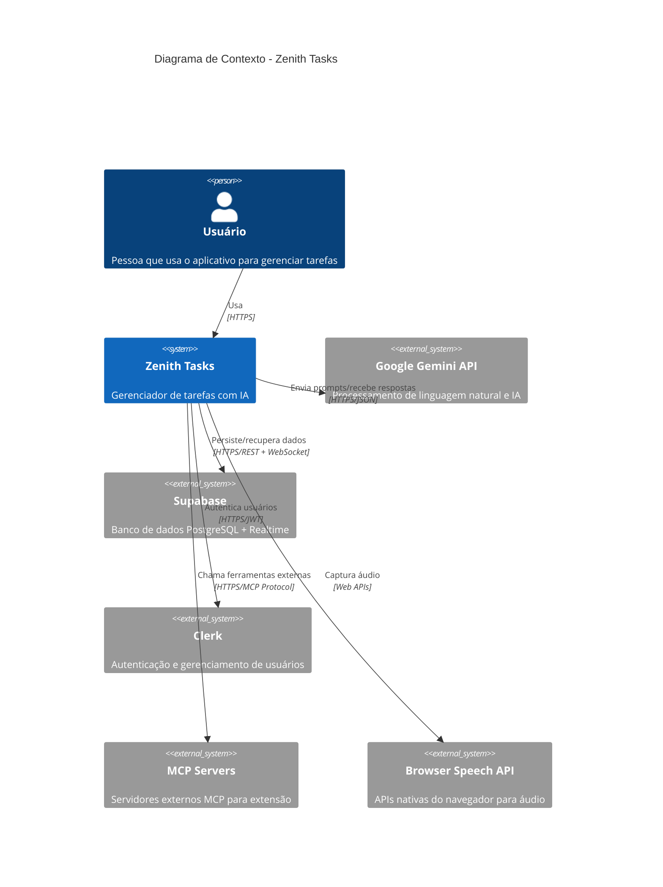
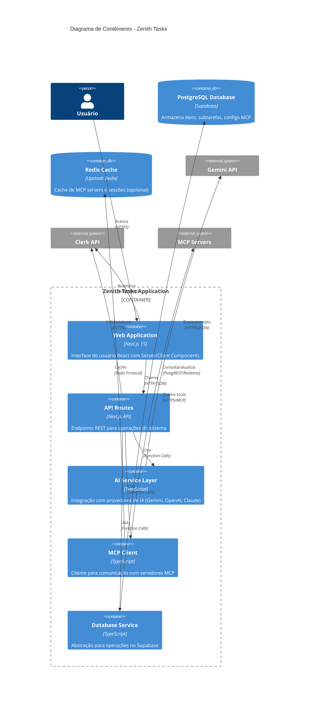
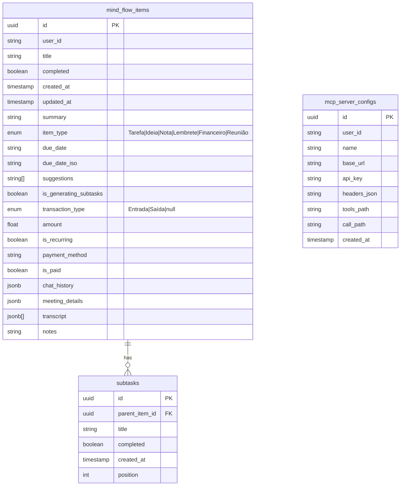
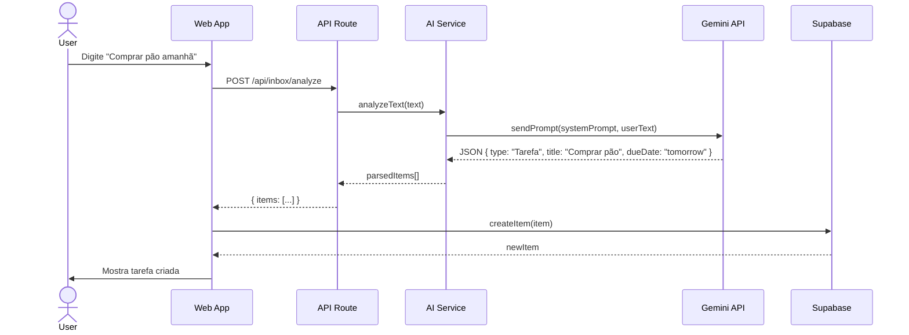
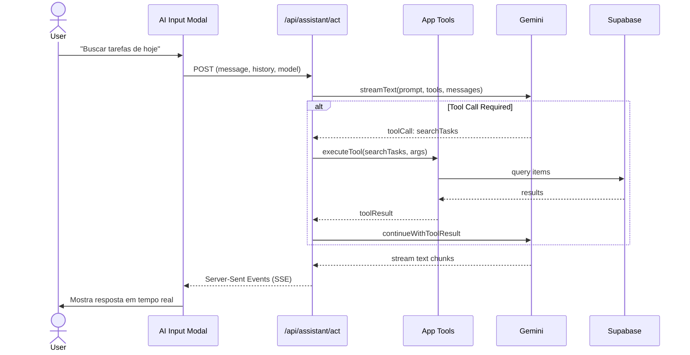
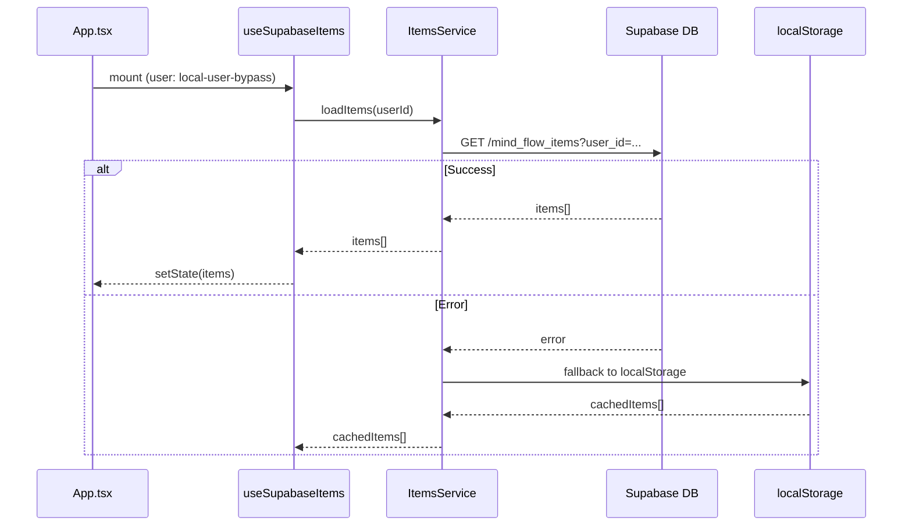

# Zenith Tasks - Documentação de Arquitetura

> **Versão:** 1.0.0
> **Última Atualização:** Janeiro 2025
> **Autor:** Guilherme Varela

## 📑 Índice

1. [Visão Geral do Sistema](#visão-geral-do-sistema)
2. [Contexto do Sistema](#contexto-do-sistema)
3. [Arquitetura de Contêineres](#arquitetura-de-contêineres)
4. [Arquitetura de Componentes](#arquitetura-de-componentes)
5. [Modelo de Dados](#modelo-de-dados)
6. [Fluxo de Dados](#fluxo-de-dados)
7. [Segurança](#segurança)
8. [Decisões Arquiteturais](#decisões-arquiteturais)

---

## 🎯 Visão Geral do Sistema

**Zenith Tasks** é um gerenciador de tarefas inteligente desenvolvido com Next.js 15, que integra inteligência artificial (Google Gemini), autenticação (Clerk), banco de dados em tempo real (Supabase) e suporte ao Model Context Protocol (MCP) para extensibilidade.

### Características Principais

- 📝 **Gerenciamento Inteligente de Tarefas** - Análise e categorização automática via IA
- 🤖 **Assistente AI Integrado** - Conversa contextual e execução de ferramentas
- 📅 **Calendário Interativo** - Visualização temporal de compromissos
- 💰 **Gestão Financeira** - Controle de entrada e saídas
- 📋 **Notas de Reunião** - Transcrição e resumo automático
- 🔌 **MCP Integration** - Protocolo para extensão via servidores MCP
- ☁️ **Sincronização em Tempo Real** - Persistência no Supabase
- 🔐 **Autenticação Segura** - Via Clerk (bypass disponível para dev)

### Stack Tecnológica

```yaml
Frontend:
  - Next.js 15.5.2 (App Router)
  - React 18.3.1
  - TypeScript 5.9.2
  - Tailwind CSS 3.4.17
  - Framer Motion 12.23.12

Backend/API:
  - Next.js API Routes
  - AI SDK 5.0.59
  - Supabase Client 2.57.4
  - Clerk Auth 6.33.1

IA/ML:
  - Google Gemini (gemini-2.5-flash)
  - OpenAI (suporte via AI SDK)
  - Anthropic Claude (suporte via AI SDK)
  - OpenRouter (opcional)

Infraestrutura:
  - Vercel (deployment)
  - Supabase (PostgreSQL + Realtime)
  - Upstash Redis (opcional, MCP registry)
```

---

## 🌐 Contexto do Sistema

### Diagrama de Contexto (C4 Model - Nível 1)



### Atores do Sistema

| Ator | Descrição | Responsabilidades |
|------|-----------|-------------------|
| **Usuário Final** | Pessoa que gerencia tarefas | - Criar/editar/excluir tarefas<br>- Conversar com IA<br>- Visualizar calendário<br>- Gerenciar finanças |
| **Google Gemini** | Serviço de IA | - Análise de texto<br>- Geração de subtarefas<br>- Chat contextual<br>- Resumo de reuniões |
| **Supabase** | Banco de dados | - Persistência de dados<br>- Sincronização em tempo real<br>- Row-level security |
| **Clerk** | Provedor de autenticação | - Login/registro<br>- Gerenciamento de sessões<br>- JWT tokens |
| **MCP Servers** | Servidores de extensão | - Ferramentas customizadas<br>- Integrações externas |

---

## 📦 Arquitetura de Contêineres

### Diagrama de Contêineres (C4 Model - Nível 2)



### Descrição dos Contêineres

#### 1. **Web Application (Next.js)**
- **Tecnologia**: Next.js 15 App Router, React 18, TypeScript
- **Responsabilidades**:
  - Renderização de páginas (SSR/SSG/CSR)
  - Componentes React (Client/Server Components)
  - Roteamento e navegação
  - Estado local e global
  - Integração com Clerk Auth
- **Portas**: 3457 (dev), 3456 (prod)

#### 2. **API Routes (Next.js API)**
- **Tecnologia**: Next.js API Routes, Edge Runtime, Node.js Runtime
- **Endpoints Principais**:
  - `/api/inbox/analyze` - Análise de texto via IA
  - `/api/subtasks/generate` - Geração de subtarefas
  - `/api/chat/for-item` - Chat contextual
  - `/api/assistant/*` - Assistente IA com tools
  - `/api/mcp/*` - Gerenciamento de servidores MCP
  - `/api/speech/transcribe` - Transcrição de áudio
  - `/api/models` - Lista modelos disponíveis
  - `/api/credits/*` - Gerenciamento de créditos

#### 3. **AI Service Layer**
- **Tecnologia**: AI SDK 5.0, Gemini SDK, OpenAI SDK
- **Responsabilidades**:
  - Abstração de provedores de IA
  - Seleção dinâmica de modelos
  - Streaming de respostas
  - Gerenciamento de tokens
  - Rate limiting
  - Cache de respostas

#### 4. **MCP Client**
- **Tecnologia**: TypeScript, Fetch API
- **Responsabilidades**:
  - Descoberta de ferramentas MCP
  - Execução de tools remotos
  - Cache de servidores
  - Gerenciamento de timeouts

#### 5. **Database Service**
- **Tecnologia**: Supabase Client, PostgreSQL
- **Responsabilidades**:
  - CRUD de itens (`mind_flow_items`)
  - CRUD de subtarefas (`subtasks`)
  - CRUD de configs MCP (`mcp_server_configs`)
  - Realtime subscriptions
  - Row-level security

---

## 🧩 Arquitetura de Componentes

### Estrutura de Diretórios

```
src/
├── app/                          # Next.js App Router
│   ├── api/                      # API Routes
│   │   ├── assistant/            # Assistente IA
│   │   ├── inbox/                # Análise de inbox
│   │   ├── subtasks/             # Geração de subtarefas
│   │   ├── chat/                 # Chat contextual
│   │   ├── mcp/                  # MCP servers
│   │   ├── speech/               # Transcrição
│   │   ├── models/               # Listagem de modelos
│   │   └── credits/              # Sistema de créditos
│   ├── layout.tsx                # Layout raiz
│   ├── page.tsx                  # Página principal
│   ├── providers.tsx             # Providers (Clerk desabilitado)
│   └── sign-in/sign-up/          # Páginas de auth
├── components/                   # Componentes React
│   ├── App.tsx                   # Componente principal
│   ├── Sidebar.tsx               # Navegação lateral
│   ├── TaskList.tsx              # Lista de tarefas
│   ├── DetailPanel.tsx           # Painel de detalhes
│   ├── CalendarPage.tsx          # Visualização de calendário
│   ├── FinancePage.tsx           # Gestão financeira
│   ├── MeetingPage.tsx           # Notas de reunião
│   ├── TalkModeModal.tsx         # Gravação de voz
│   ├── ModelSelector.tsx         # Seletor de modelos IA
│   ├── ai/                       # Componentes relacionados a IA
│   │   └── CreditMonitor.tsx     # Monitor de créditos
│   └── ui/                       # Componentes UI genéricos
│       ├── AiInput.tsx           # Input de IA com streaming
│       ├── button.tsx            # Botão estilizado
│       ├── SiriOrb.tsx           # Animação de IA
│       └── visualize-booking.tsx # Calendário interativo
├── hooks/                        # React Hooks customizados
│   ├── useSupabaseItems.ts       # Hook para itens do Supabase
│   ├── useRealTimeTranscription.ts # Transcrição em tempo real
│   └── use-click-outside.tsx     # Detectar cliques externos
├── lib/                          # Bibliotecas e configurações
│   ├── supabase.ts               # Cliente Supabase
│   └── utils.ts                  # Utilitários gerais
├── server/                       # Lógica server-side
│   ├── aiProvider.ts             # Provider de IA (Gemini/OpenAI)
│   ├── mcpRegistry.ts            # Registro de servidores MCP
│   ├── rateLimit.ts              # Rate limiting
│   └── ai/                       # Serviços de IA
│       ├── chat-service.ts       # Serviço de chat
│       ├── error-handler.ts      # Tratamento de erros
│       ├── security.ts           # Validações de segurança
│       ├── prompt-optimizer.ts   # Otimização de prompts
│       ├── gateway/              # AI Gateway
│       │   ├── provider.ts       # Provider do gateway
│       │   ├── model-selector.ts # Seleção de modelos
│       │   └── credit-monitor.ts # Monitor de créditos
│       ├── prompts/              # Templates de prompts
│       │   └── assistant-prompt.ts
│       └── tools/                # Ferramentas do assistente
│           ├── index.ts          # Registro de tools
│           ├── app-tools.ts      # Tools do app (search, create, etc)
│           └── analysis-tools.ts # Tools de análise
├── services/                     # Serviços de negócio
│   ├── ai/                       # Serviços de IA
│   │   ├── index.ts              # Ponto de entrada
│   │   ├── prompts.ts            # Prompts reutilizáveis
│   │   ├── parse.ts              # Parsing de respostas
│   │   └── tools.ts              # Definição de tools
│   ├── database/                 # Serviços de banco
│   │   ├── items.ts              # CRUD de itens
│   │   ├── meetings.ts           # CRUD de reuniões
│   │   ├── data-validator.ts     # Validação de dados
│   │   ├── performance-monitor.ts # Monitor de performance
│   │   └── maintenance-scheduler.ts # Manutenção agendada
│   ├── mcp/                      # Serviços MCP
│   │   ├── client.ts             # Cliente MCP
│   │   ├── store.ts              # Store de configurações
│   │   └── types.ts              # Tipos MCP
│   ├── credits/                  # Sistema de créditos
│   │   └── credit-system.ts      # Gerenciamento de créditos
│   ├── streaming/                # Streaming de dados
│   │   ├── event-stream.ts       # Stream de eventos
│   │   └── transcription-service.ts # Transcrição em stream
│   ├── monitoring/               # Monitoramento
│   │   └── alert-system.ts       # Sistema de alertas
│   └── analytics/                # Analytics
│       └── token-usage.ts        # Análise de uso de tokens
├── state/                        # Gerenciamento de estado
│   └── items.ts                  # Estado de itens
├── types/                        # Definições de tipos
│   └── index.ts                  # Tipos principais (MindFlowItem, etc)
└── utils/                        # Utilitários
    ├── date.ts                   # Funções de data
    ├── logger.ts                 # Sistema de logs
    ├── base64.ts                 # Encoding/decoding
    ├── json-helpers.ts           # Helpers JSON
    ├── safe-json.ts              # Parse seguro de JSON
    ├── item-filters.ts           # Filtros de itens
    └── state-updates.ts          # Atualizações de estado
```

### Componentes Principais

#### 1. **App.tsx** - Componente Raiz
```typescript
Responsabilidades:
- Gerenciamento de estado global de itens
- Roteamento entre páginas (caixa-entrada, tarefas, calendário, etc)
- Orquestração de operações CRUD
- Integração com Supabase via useSupabaseItems hook
- Bypass de autenticação Clerk (usuário fake: local-user-bypass)
```

#### 2. **Sidebar.tsx** - Navegação
```typescript
Responsabilidades:
- Navegação entre seções do app
- Busca de tarefas
- Contadores de itens por tipo
- Botão de Talk Mode
- Avatar do usuário (bypass)
```

#### 3. **TaskList.tsx** - Lista de Tarefas
```typescript
Responsabilidades:
- Renderização de lista de itens
- Filtros e ordenação
- Interação com itens (marcar como concluído, deletar)
- Criação de novos itens
```

#### 4. **DetailPanel.tsx** - Painel de Detalhes
```typescript
Responsabilidades:
- Exibição detalhada de um item
- Edição de campos
- Geração de subtarefas via IA
- Chat contextual com IA
- Gerenciamento de subtarefas
```

#### 5. **AI Input (AiInput.tsx)** - Interface de IA
```typescript
Responsabilidades:
- Input flutuante com animação Siri Orb
- Streaming de respostas do assistente
- Seletor de modelos
- Histórico de mensagens
```

---

## 🗄️ Modelo de Dados

### Schema do Supabase



### Tipos TypeScript

```typescript
// src/types/index.ts

export type MindFlowItemType =
  | 'Tarefa'
  | 'Ideia'
  | 'Nota'
  | 'Lembrete'
  | 'Financeiro'
  | 'Reunião'

export interface MindFlowItem {
  id: string
  title: string
  completed: boolean
  createdAt: string
  summary?: string
  type: MindFlowItemType
  dueDate?: string
  dueDateISO?: string
  subtasks?: Subtask[]
  suggestions?: string[]
  isGeneratingSubtasks?: boolean
  chatHistory?: ChatMessage[]

  // Financeiro
  transactionType?: 'Entrada' | 'Saída'
  amount?: number
  isRecurring?: boolean
  paymentMethod?: string
  isPaid?: boolean

  // Reunião
  meetingDetails?: MeetingDetails
  transcript?: ChatBubble[]
  notes?: string
}

export interface Subtask {
  id: string
  title: string
  completed: boolean
  createdAt: string
}

export interface ChatMessage {
  role: 'user' | 'model' | 'assistant'
  parts: { text: string }[]
}

export interface MeetingDetails {
  summary: string
  topics: string[]
  actionItems: string[]
}

export interface ChatBubble {
  speaker: 'user' | 'assistant'
  text: string
  timestamp: string
}
```

---

## 🔄 Fluxo de Dados

### 1. Fluxo de Criação de Tarefa com IA



### 2. Fluxo de Chat com Assistente



### 3. Fluxo de Sincronização com Supabase



---

## 🔐 Segurança

### Autenticação e Autorização

```yaml
Estado Atual:
  - Clerk Auth: DESABILITADO (bypass ativo)
  - Usuário fake: "local-user-bypass"
  - Sem validação de JWT
  - RLS Supabase: Baseado em user_id

Recomendações para Produção:
  1. Reativar Clerk ou implementar auth própria
  2. Validar tokens JWT em API routes
  3. Configurar RLS policies no Supabase
  4. Implementar rate limiting por usuário
```

### Middleware de Segurança

```typescript
// src/middleware.ts
export function middleware(request: NextRequest) {
  // Bypass ativo - permite acesso a todas as rotas
  return NextResponse.next()
}
```

**⚠️ ATENÇÃO**: Em produção, reativar autenticação!

### Row-Level Security (Supabase)

```sql
-- Exemplo de política RLS (a ser implementada)
CREATE POLICY "Users can only see their own items"
ON mind_flow_items
FOR SELECT
USING (auth.uid() = user_id);

CREATE POLICY "Users can only insert their own items"
ON mind_flow_items
FOR INSERT
WITH CHECK (auth.uid() = user_id);
```

### Validação de Input

```typescript
// src/server/ai/security.ts
export function sanitizeUserInput(input: string): string {
  // Remove caracteres perigosos
  // Limita tamanho
  // Valida formato
}

export function validateAPIRequest(body: any): boolean {
  // Valida schema
  // Verifica rate limits
  // Checa permissões
}
```

---

## 📊 Decisões Arquiteturais

### ADR-001: Next.js 15 com App Router

**Status**: ✅ Aceito

**Contexto**: Precisávamos de um framework moderno para React com SSR, API routes e boa DX.

**Decisão**: Usar Next.js 15 com App Router (em vez de Pages Router).

**Consequências**:
- ✅ Server Components por padrão
- ✅ Streaming de UI e dados
- ✅ Layout compartilhados
- ✅ Co-location de código
- ⚠️ Curva de aprendizado maior

---

### ADR-002: Supabase como Backend

**Status**: ✅ Aceito

**Contexto**: Precisávamos de um backend escalável com realtime e auth.

**Decisão**: Usar Supabase (PostgreSQL + Realtime).

**Consequências**:
- ✅ Realtime subscriptions out-of-the-box
- ✅ Row-level security
- ✅ Migrations e backups automáticos
- ✅ API REST gerada automaticamente
- ⚠️ Vendor lock-in moderado

---

### ADR-003: AI SDK 5.0 com Múltiplos Provedores

**Status**: ✅ Aceito

**Contexto**: Queríamos flexibilidade para trocar modelos de IA sem reescrever código.

**Decisão**: Usar Vercel AI SDK 5.0 com abstração de provedores.

**Consequências**:
- ✅ Troca de modelos sem refactor
- ✅ Streaming de respostas
- ✅ Tool calling padronizado
- ✅ Suporte a Gemini, OpenAI, Claude, etc
- ⚠️ Dependência de biblioteca externa

---

### ADR-004: Clerk Auth com Bypass para Dev

**Status**: ⚠️ Temporário

**Contexto**: Clerk estava configurado, mas desabilitado para simplificar desenvolvimento.

**Decisão**: Bypass temporário com usuário fake ("local-user-bypass").

**Consequências**:
- ✅ Desenvolvimento mais rápido
- ✅ Sem necessidade de login
- ❌ **NÃO USAR EM PRODUÇÃO**
- ❌ Sem segurança real

**Próximos Passos**:
1. Reativar Clerk antes do deploy
2. Remover usuário fake
3. Configurar RLS no Supabase

---

### ADR-005: Model Context Protocol (MCP) para Extensibilidade

**Status**: ✅ Aceito

**Contexto**: Queríamos permitir que usuários adicionassem ferramentas customizadas sem modificar o código.

**Decisão**: Implementar cliente MCP para chamar servidores externos.

**Consequências**:
- ✅ Extensibilidade sem rebuild
- ✅ Integração com ferramentas externas
- ✅ Comunidade MCP crescente
- ⚠️ Complexidade adicional
- ⚠️ Segurança de servidores externos

---

## 📈 Próximos Passos

### Curto Prazo (1-2 meses)
- [ ] Reativar autenticação Clerk
- [ ] Implementar RLS no Supabase
- [ ] Adicionar testes automatizados (Jest, Playwright)
- [ ] Melhorar tratamento de erros
- [ ] Adicionar logs estruturados (Pino/Winston)

### Médio Prazo (3-6 meses)
- [ ] Implementar sistema de cache (Redis)
- [ ] Adicionar monitoramento (Sentry, DataDog)
- [ ] Criar API pública com rate limiting
- [ ] Implementar webhooks para integrações
- [ ] Adicionar suporte a equipes/workspaces

### Longo Prazo (6-12 meses)
- [ ] Migrar para microserviços (se necessário)
- [ ] Implementar GraphQL API
- [ ] Adicionar suporte offline (PWA)
- [ ] Criar apps mobile (React Native)
- [ ] Implementar analytics avançado

---

## 📚 Referências

- [Next.js Documentation](https://nextjs.org/docs)
- [Supabase Documentation](https://supabase.com/docs)
- [Vercel AI SDK](https://sdk.vercel.ai/docs)
- [Model Context Protocol](https://modelcontextprotocol.io/)
- [C4 Model](https://c4model.com/)
- [Architecture Decision Records](https://adr.github.io/)

---

**Última atualização**: Janeiro 2025
**Versão do documento**: 1.0.0
**Mantenedor**: Guilherme Varela
